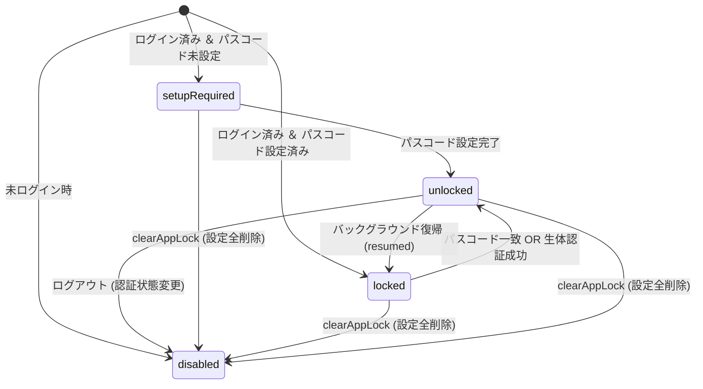

# 🔐 アプリロック機能 (App Lock)

アプリのセキュリティ向上を目的とし、ログインユーザーに対して PIN パスコード設定および Face ID / Touch ID / 生体認証によるロック解除を提供する機能です。

---

## 1. 概要

アプリロック機能は、離席時やアプリ切り替え時にアプリ内の機密情報（メモ、プロファイル等）が第三者に閲覧されるのを防ぎます。

- **4桁 PIN パスコード**: 迅速に入力できる数値キーパッドを提供（連続失敗時の指数関数的ロックアウト保護 & 永続化付き）。
- **生体認証 (Biometrics)**: iOS (Face ID / Touch ID) および Android (指紋認証 / 顔認証) に対応。
- **最前面保護 (AppLockWrapper)**: ルーティング階層に依存せず、アプリ全体の最前面にオーバーレイとしてロック画面を描画（初期化中・ロード時は保護シールド描画、エラー時はロック画面フォールバック）。
- **自動再ロック**: アプリがバックグラウンドからフォアグラウンド（`resumed`）へ復帰した際に自動再ロックを実施。

---

## 2. アーキテクチャ

Feature-Driven Architecture に従い、機能単位で層を分離しています。

```plaintext
lib/src/features/app_lock/
├── application/
│   └── app_lock_service.dart               # ロック状態の制御・解除・設定ロジック (AsyncNotifier)
├── data/
│   ├── app_lock_repository.dart            # パスコード・生体認証設定の暗号化永続化
│   └── local_authentication_provider.dart  # local_auth パッケージの DI
├── domain/
│   └── app_lock_state.dart                 # ロック状態の Sealed クラス (disabled, setupRequired, locked, unlocked)
└── presentation/
    ├── app_lock_wrapper.dart               # 最前面オーバーレイ制御ウィジェット
    ├── passcode_lock_screen.dart           # ロック解除画面
    ├── passcode_setup_screen.dart          # 初回パスコード設定・生体認証有効化画面
    └── widgets/
        ├── numeric_keyboard.dart           # 独自数値キーパッド
        └── pin_code_field.dart             # 4桁ドットインジケータ
```

---

## 3. 状態遷移 (AppLockState)

`AppLockState` は Freezed を用いた `sealed` クラスとして定義されています。



1. **`disabled`**: 未ログイン状態。ロック機能は無効。
2. **`setupRequired`**: ログイン済みだがパスコードが未登録。アプリ起動時に初期設定画面を表示。
3. **`locked`**: パスコード登録済み。起動時・復帰時にロック画面を表示。
4. **`unlocked`**: 正しいパスコード入力または生体認証成功により一時的にロック解除された状態。

> 💡 **ログアウトと `clearAppLock()` の違い**
>
> - **ログアウト**: `authStateProvider` や `firebaseAuthStateProvider` の状態がログアウト状態に変化した際、`AppLockService.build()` がそれを検知して自動的に `disabled` 状態を返します（保存されたパスコード・生体認証設定は保持されます）。
> - **`clearAppLock()`**: 暗号化保存されたパスコードおよび生体認証設定データを完全に削除し、明示的に `disabled` 状態へ切り替えるメソッドです。

---

## 4. セキュリティ・誤動作防止設計

### 暗号化ストレージへの保存

- PIN パスコードは OS の安全な領域（iOS Keychain / Android Keystore）に `FlutterSecureStorage` 経由で暗号化保存されます。
- 生体認証の有効/無効フラグは `SharedPreferences` に保存されます。

### パスコード連続失敗制限（ブルートフォース保護）

- パスコード入力に連続 3 回失敗した場合、安全のため一時ロックアウト期間が発生します。
- 失敗回数およびロックアウト期限は OS の暗号化ストレージ（`FlutterSecureStorage`）に安全に永続化されるため、アプリのタスクキル・再起動を行ってもロックアウト制限が維持されます。
- ロックアウト時間は失敗回数に応じて指数関数的（3回失敗: 30秒, 4回失敗: 60秒, 5回失敗: 120秒...）に増加します。
- ロックアウト期間中の試行は、暗号化ストレージへの照合（`verifyPasscode`）を行わずに即座に拒否されます。
- パスコード認証成功時または `clearAppLock()` 実行時に、失敗カウントおよびロックアウト状態は Secure Storage から自動リセットされます。

### OS 生体認証ダイアログの遅延・復帰保護

- 生体認証実行中（Face ID ダイアログ表示中）は、OS から発行される `resumed` イベントによる二重ロックを防ぐため `_isAuthenticating` フラグで排他制御しています。
- OS の生体認証プロンプト閉じに伴い発生する復帰イベントのみを `_promptDismissedAt` で追跡・初回消費することで誤ロックを防ぎ、手動によるアプリ復帰時は即座に再ロックされるよう制御しています。

---

## 5. テスト構成

単体テスト・ウィジェットテスト・ゴールデンテストにより 100% のテストカバレッジを維持しています。

- **単体テスト**: `test/src/features/app_lock/data/app_lock_repository_test.dart`, `app_lock_service_test.dart`
- **ウィジェットテスト**: `passcode_setup_screen_test.dart`, `passcode_lock_screen_test.dart`, `app_lock_wrapper_test.dart`, `numeric_keyboard_test.dart`
- **ゴールデンテスト**: `app_lock_golden_test.dart` (`alchemist` によるライト/ダークモード描画検証)
