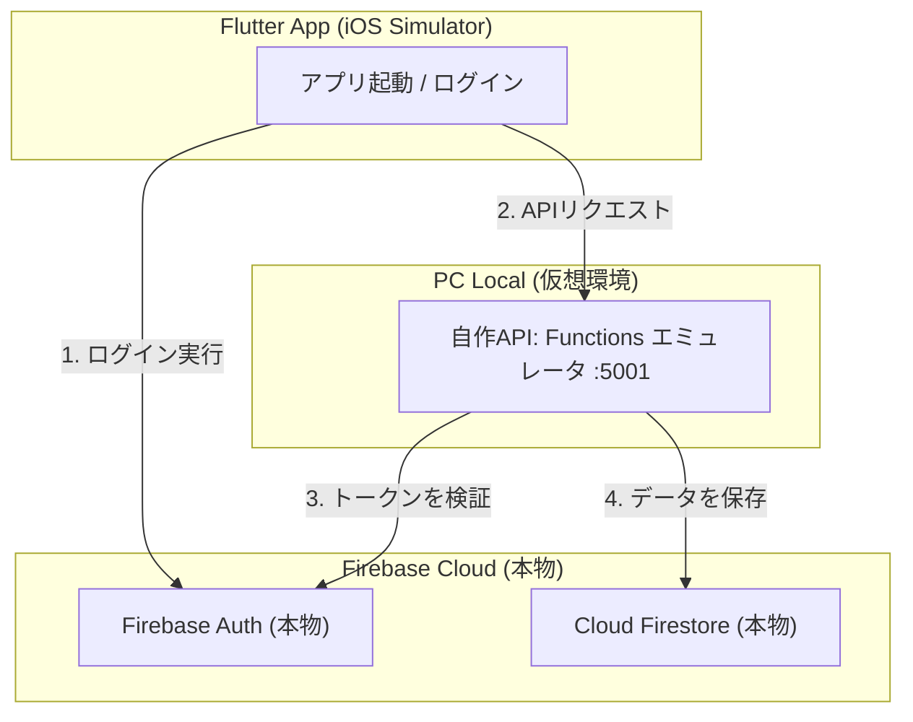

# ローカル自作APIサーバー (Firebase Functions エミュレータ)

## 概要

このプロジェクトでは、`dev`（開発）フレーバーにおいて、ローカルPC上でAPIプログラム（Cloud Functions）を動かしながら、クラウド上の本物の Firebase サービス（Auth / Firestore）と組み合わせてデバッグできる、効率的でセキュアなハイブリッド環境を構築しています。

アプリのログイン情報（IDトークン）をAPI側で自動検証し、クラウドの Firestore にユーザーごとの個別のデータ（`users/{uid}/memos` など）を安全に読み書きします。

---

## 🛠 前提条件

- **Node.js** (v20以上を推奨) がインストールされていること。
- **Firebase CLI** (`firebase login` など) の初期セットアップが完了していること。

---

## 📁 ディレクトリ構成

自作API（Functions）に関連するファイルは、プロジェクトルートの `functions/` ディレクトリに集約されています。

```plaintext
functions/
 ├── src/
 │    └── index.ts     # APIのエントリポイント（memos、users/me、usersを実装）
 ├── package.json      # Node.jsの依存関係パッケージとビルドスクリプトの定義
 └── tsconfig.json     # TypeScript of コンパイル設定
```

---

## 🚀 使い方

### 1. 依存ライブラリのインストールとコンパイル

Functionsプログラムは TypeScript で記述されているため、初めて実行する前や、コードを書き換えた後は必ずコンパイル（ビルド）が必要です。

```bash
# functions ディレクトリで依存パッケージをインストール (初回のみ)
npm install --prefix functions

# プログラムを JavaScript にビルドする (コード編集の都度実行)
npm run --prefix functions build
```

### 2. APIエミュレータの起動

ローカルPC上で自作APIのみを起動します。FirestoreやAuthのエミュレータは起動せず、自動的に本物の Firebase（クラウド）と通信を行います。

```bash
npx -y firebase-tools@latest emulators:start --only functions
```

起動が成功すると、ターミナルに以下のようなURLが公開されます。
`✔  functions[us-central1-memos]: http function initialized (http://127.0.0.1:5001/<プロジェクトID>/us-central1/memos).`

### 3. アプリ（Flutter）の起動

Flutterアプリを **`dev` フレーバー** で起動してください。

```bash
fvm flutter run --flavor dev -t lib/main_dev.dart --dart-define-from-file=config/flavor_dev.json --dart-define-from-file=.env.dev
```

- **接続先の確認**:
  `config/flavor_dev.json` の `BASE_URL` が、上記のローカルAPIのURL（ `http://localhost:5001/<各自のプロジェクトID>/us-central1` ）に設定されていることを確認してください。

---

## ✨ データフローとセキュリティ



1. **セキュアな通信**:
   - アプリがログインすると、自動的に「本物のIDトークン」が取得され、APIリクエストの `Authorization` ヘッダーに付与されてローカルAPIに送信されます。
2. **トークンの自動検証**:
   - ローカルで動くAPI（Functions）は、送られてきたトークンを本物の Firebase Auth に問い合わせて検証し、「ログイン中のユーザーの UID」を安全に特定します。
3. **データ分離**:
   - 特定した UID を元に、クラウド上の本物 Firestore の `users/{uid}/memos` などの階層にデータを保存します。他のユーザーのデータと完全に隔離されて安全にデータが保管されます。

---

## 🚀 本番環境（Firebase）へのデプロイ手順

将来的に、PCを起動していなくてもAPIがインターネット経由で動くように本番環境へアップロード（デプロイ）する際の手順です。

### 1. Firebase料金プランの変更 (Blazeプランへの移行)

- Cloud Functionsを本番サーバーへデプロイするには、Firebaseプロジェクトの料金プランを無料の「Spark」から、従量課金プランの **「Blazeプラン」** へアップグレードする必要があります。
- **手順**: Firebase Console の左下にある「アップグレード」をクリックし、クレジットカード情報を登録してBlazeプランに切り替えます。
- _(※無料枠が非常に大きいため、個人開発やテスト利用の範囲内であれば基本的に課金は発生しません)_

### 2. APIプログラムのコンパイルとデプロイ

コンパイルを行い、Functionsプログラムのみを本番サーバーへアップロードします。

```bash
# 1. APIプログラムのコンパイル (TypeScript ➡️ JavaScript)
npm run --prefix functions build

# 2. 本番へのデプロイ (Functions のみデプロイ)
npx firebase deploy --only functions
```

デプロイが成功すると、ターミナルに以下のような本番用のURLが出力されます。
`✔  functions[us-central1-memos]: http function initialized (https://us-central1-<プロジェクトID>.cloudfunctions.net/memos).`

### 3. アプリの接続先の切り替え

- 上記で出力された本番用のURLを確認します。
- `config/flavor_dev.json`（または本番用の `flavor_prod.json`）の `BASE_URL` に、この本番用URL（ `https://us-central1-<プロジェクトID>.cloudfunctions.net` ）を設定します。
- アプリを起動し、PC上のエミュレータを止めた状態でも、インターネット経由でメモの追加やプロフィールの更新ができるかテストします。
