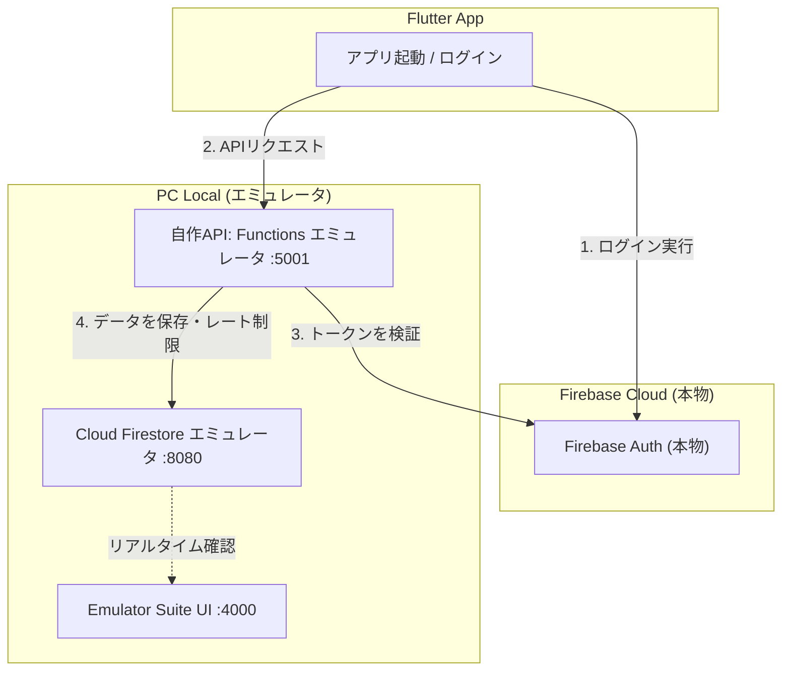

# ローカル自作APIサーバー (Firebase Functions & Firestore エミュレータ)

## 概要

このプロジェクトでは、`dev`（開発）フレーバーにおいて、ローカルPC上でAPIプログラム（Cloud Functions）およびデータストア（Cloud Firestore）のエミュレータを動かしながら、クラウド上の本物の Firebase Auth と組み合わせてデバッグできる、効率的でセキュアなハイブリッド環境を構築しています。

アプリのログイン情報（IDトークン）をAPI側で自動検証し、ローカルの Firestore エミュレータにユーザーごとの個別のデータ（`users/{uid}/memos` や `rate_limits` など）を安全に読み書きします。

---

## 🛠 前提条件

- **Node.js** (v22以上を推奨) がインストールされていること。
- **Firebase CLI** (`firebase login` など) の初期セットアップが完了していること。

---

## 📁 ディレクトリ構成

自作API（Functions）に関連するファイルは、プロジェクトルートの `functions/` ディレクトリに集約されています。

```plaintext
functions/
 ├── src/
 │    └── index.ts     # APIのエントリポイント（memos、users/me、users、computeRoutesProxyを実装）
 ├── package.json      # Node.jsの依存関係パッケージとビルドスクリプトの定義
 └── tsconfig.json     # TypeScript of コンパイル設定
```

---

## 🚀 使い方

### 1. 依存ライブラリのインストールとコンパイル

Functionsプログラムは TypeScript で記述されているため、初めて実行する前や、コードを書き換えた後は必ずコンパイル（ビルド）が必要です。

```bash
# functions ディレクトリで依存パッケージをインストール (初回のみ)
npm install --prefix functions

# プログラムを JavaScript にビルドする (コード編集の都度実行)
npm run --prefix functions build
```

### 2. APIエミュレータの起動

ローカルPC上で自作API（Functions）およびデータストア（Firestore）のエミュレータを起動します。Authのエミュレータは起動せず、自動的にクラウド上の本物の Firebase Auth と通信を行ってログイン・トークン検証を行います。

```bash
npx -y firebase-tools@latest emulators:start --only functions,firestore
```

起動が成功すると、ターミナルに以下のようなURLが公開されます。  
`✔  functions[us-central1-memos]: http function initialized (http://127.0.0.1:5001/<プロジェクトID>/us-central1/memos).`  
`✔  Emulator UI: http://127.0.0.1:4000/`

> 💡 **スマホ実機から LAN 経由で接続する場合**:
>
> - スマホ実機からローカルエミュレータに接続する場合は、`firebase.json` の `emulators` に `"host": "0.0.0.0"` を指定して起動します。
> - ⚠️ **セキュリティ注意**: `0.0.0.0` によるポート（5001, 8080）開放は、自宅や社内 Wi-Fi などの信頼できるプライベートネットワークでのみ利用してください。公共 Wi-Fi 環境では、ポート開放が不要な [HTTPS トンネル方式](./setup.md#方法-a-https-トンネルを利用する推奨設定変更不要) の利用を推奨します。

### 3. アプリ（Flutter）の起動

Flutterアプリを **`dev` フレーバー** で起動してください。

```bash
fvm flutter run --flavor dev -t lib/main_dev.dart --dart-define-from-file=config/flavor_dev.json --dart-define-from-file=.env.dev
```

- **接続先の確認**:
  各自の `.env.dev` ファイルに、自身のローカル Firebase エミュレータ URL を設定します。（※`--dart-define-from-file=.env.dev` により、チーム共有の `config/flavor_dev.json` より優先して適用されます）
  - **iOS シミュレータ / Web**: `BASE_URL=http://localhost:5001/<各自のプロジェクトID>/us-central1`
  - **Android エミュレータ**: `BASE_URL=http://10.0.2.2:5001/<各自のプロジェクトID>/us-central1`
  - **実機 (iOS / Android)**: `BASE_URL=http://<開発PCのIPアドレス>:5001/<各自のプロジェクトID>/us-central1`

---

## ✨ データフローとセキュリティ


```mermaid
graph TD
    subgraph "Flutter App"
        A["アプリ起動 / ログイン"]
    end

    subgraph "Firebase Cloud (本物)"
        B["Firebase Auth (本物)"]
    end

    subgraph "PC Local (エミュレータ)"
        C["自作API: Functions エミュレータ :5001"]
        D["Cloud Firestore エミュレータ :8080"]
        E["Emulator Suite UI :4000"]
    end

    A -->|1. ログイン実行| B
    A -->|2. APIリクエスト| C
    C -->|3. トークンを検証| B
    C -->|4. データを保存・レート制限| D
    D -.->|リアルタイム確認| E
```

1. **セキュアな通信**:
   - アプリがログインすると、自動的に「本物のIDトークン」が取得され、APIリクエストの `Authorization` ヘッダーに付与されてローカルAPIに送信されます。
2. **トークンの自動検証**:
   - ローカルで動くAPI（Functions）は、送られてきたトークンを本物の Firebase Auth に問い合わせて検証し、「ログイン中のユーザーの UID」を安全に特定します。
3. **ローカル完結のデータ保管**:
   - 特定した UID を元に、ローカルの Firestore エミュレータ（`users/{uid}/memos` や `rate_limits` など）にデータを安全に保存します。ローカル完結のため、クラウドの本番・開発DBを汚すことなく自由にテスト・デバッグが可能です。
   - Emulator Suite UI（`http://localhost:4000/firestore`）から、保存されたデータをブラウザ上でリアルタイムに閲覧・確認できます。

---

## 🚀 本番環境（Firebase）へのデプロイ手順

将来的に、PCを起動していなくてもAPIがインターネット経由で動くように本番環境へアップロード（デプロイ）する際の手順です。

### 1. Firebase料金プランの変更 (Blazeプランへの移行)

- Cloud Functionsを本番サーバーへデプロイするには、Firebaseプロジェクトの料金プランを無料の「Spark」から、従量課金プランの **「Blazeプラン」** へアップグレードする必要があります。
- **手順**: Firebase Console の左下にある「アップグレード」をクリックし、クレジットカード情報を登録してBlazeプランに切り替えます。
- _(※無料枠が非常に大きいため、個人開発やテスト利用の範囲内であれば基本的に課金は発生しません)_

### 2. APIプログラムのコンパイルとデプロイ

コンパイルを行い、Functionsプログラムのみを本番サーバーへアップロードします。

```bash
# 1. APIプログラムのコンパイル (TypeScript ➡️ JavaScript)
npm run --prefix functions build

# 2. 本番へのデプロイ (Functions のみデプロイ)
firebase deploy --only functions
```

デプロイが成功すると、ターミナルに以下のような本番用のURLが出力されます。  
`✔  functions[us-central1-memos]: http function initialized (https://us-central1-<プロジェクトID>.cloudfunctions.net/memos).`

### 3. アプリの接続先の切り替え

- 上記で出力されたクラウド環境用のURLを確認します。
- **本番環境 (`prod` フレーバー)**: `config/flavor_prod.json` または `.env.prod` の `BASE_URL` に設定してビルドします。
- **ステージング環境 (`stg` フレーバー)**: `.env.stg` の `BASE_URL` に設定してテスト可能です（※動作確認時にログへ警告アラートが出力されます）。
- **開発・ローカル環境 (`local` / `dev` フレーバー)**: 誤操作による本番データ汚染防止のため、`cloudfunctions.net` への接続はアプリ起動時に自動的に安全ガード（例外）により拒否されます。ローカルエミュレータをご利用ください。
