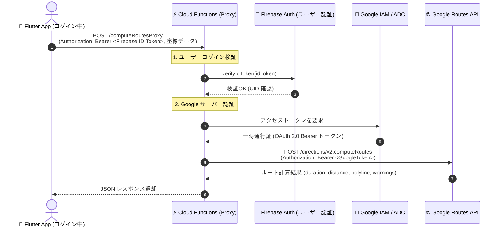

# 🗺️ 地図機能 (Map Feature)

本モジュールは、Google Maps Platform (`google_maps_flutter`)、Geolocator (`geolocator`)、および Geocoding (`geocoding`) を採用し、ネイティブ地図の表示、位置情報の動的取得・カメラ移動、住所・ランドマーク検索機能、複数候補地インタラクティブ選択モーダル、カスタムスポット（施設・ピン）のプロット、スポット詳細モーダル表示、および2点間のルート検索とナビゲーション経路描画（Polyline & RouteNavigationCard）機能を提供します。

---

## 📁 ディレクトリ構造

```plaintext
lib/src/features/map/
 ├── domain/
 │    ├── location_candidate.dart           # 検索候補地モデル (Freezed)
 │    ├── location_candidate.freezed.dart   # Freezed自動生成コード
 │    ├── location_state.dart               # 位置情報および権限状態モデル (Sealed class)
 │    ├── location_state.freezed.dart       # Freezed自動生成コード
 │    ├── map_route.dart                    # 2点間ルートモデル (Freezed)
 │    ├── map_route.freezed.dart            # Freezed自動生成コード
 │    ├── map_route_state.dart              # ルート案内状態モデル (Sealed class)
 │    ├── map_route_state.freezed.dart      # Freezed自動生成コード
 │    ├── map_search_state.dart             # 検索状態モデル (Sealed class)
 │    ├── map_search_state.freezed.dart     # Freezed自動生成コード
 │    ├── map_spot.dart                     # カスタムスポットモデル & SpotCategory 列挙型 (Freezed)
 │    ├── map_spot.freezed.dart             # Freezed自動生成コード
 │    └── travel_mode.dart                  # 移動手段列挙型 (driving, walking, bicycling, transit)
 ├── data/
 │    ├── location_repository.dart          # Geolocator ネイティブAPIの安全なラッパー
 │    ├── location_repository.g.dart        # Riverpod生成プロバイダー
 │    ├── geocoding_repository.dart         # Geocoding プラットフォームAPIの安全なラッパー
 │    ├── geocoding_repository.g.dart       # Riverpod生成プロバイダー
 │    ├── polyline_decoder.dart             # Google Encoded Polyline Algorithm 座標復元デコーダー
 │    ├── route_repository.dart             # ルート検索・経路計算リポジトリ (RouteRepositoryImpl / MockRouteRepository)
 │    ├── route_repository.g.dart           # Riverpod生成プロバイダー
 │    ├── spot_repository.dart              # 周辺スポットデータ取得リポジトリ
 │    └── spot_repository.g.dart            # Riverpod生成プロバイダー
 ├── application/
 │    ├── map_notifier.dart                 # 地図のカメラ位置・パーミッション制御 Notifier
 │    ├── map_notifier.g.dart               # Riverpod生成 Notifier
 │    ├── map_route_notifier.dart           # ルート検索・案内状態 Notifier (競合世代管理・TravelMode対応)
 │    ├── map_route_notifier.g.dart         # Riverpod生成 Notifier
 │    ├── map_search_notifier.dart          # 住所・ランドマーク検索状態 Notifier
 │    ├── map_search_notifier.g.dart        # Riverpod生成 Notifier
 │    ├── spot_notifier.dart                # カスタムスポット一覧状態 Notifier
 │    └── spot_notifier.g.dart              # Riverpod生成 Notifier
 └── presentation/
      ├── map_screen.dart                   # ネイティブ地図描画・現在地取得UI・Floating検索バー・カスタムピン描画・Polyline描画・移動手段切り替え連携 (多言語対応)
      └── widgets/
           ├── route_navigation_card.dart   # 目的地・移動手段切り替え(車/徒歩/自転車/公共交通)・距離・所要時間・案内終了ボタン表示カード (多言語対応)
           └── spot_detail_bottom_sheet.dart# スポット詳細モーダル表示ウィジェット (多言語対応)
```

---

## 💡 仕様と設計のコアコンセプト

### 1. 安全な権限ハンドリングと状態モデル (Domain層)

`LocationState`、`MapSearchState` および `MapRouteState` に Sealed class を採用し、位置情報の取得状態（初期値、ロード中、成功、権限拒否、権限永久拒否、GPS無効、エラー）、住所検索状態（初期値、検索中、成功、該当なし、エラー）、およびルート案内状態（初期値、計算中、成功、エラー）をコンパイラレベルで厳密にモデリングしています。検索結果は `LocationCandidate` リストとして保持され、ルート情報は `MapRoute`（経由点リスト、距離、所要時間、境界矩形、移動手段、警告情報 warnings）としてカプセル化されています。また、`TravelMode` enum（車: `driving`、徒歩: `walking`、自転車: `bicycling`、公共交通: `transit`）により移動手段に応じた経路検索を厳密に管理しています。

### 2. リポジトリ層のカプセル化 (Data層)

`LocationRepository`、`GeocodingRepository`、`RouteRepository` および `SpotRepository` にて外部依存・通信ロジックを集約し、テスト時にモックやテスト用ハンドラを注入可能とすることで、100% 決定論的な単体・ウィジェットテストを可能にしています。

- **`RouteRepositoryImpl`**: 設定ファイルで指定されたルート検索エンドポイント（`GOOGLE_DIRECTIONS_API_URL`）と POST 通信し、指定された `TravelMode`（車: `DRIVE`、徒歩: `WALK`、自転車: `BICYCLE`、公共交通機関: `TRANSIT`）の道路ネットワークに沿った経路 Polyline、総距離、所要時間、警告情報（`warnings`）を取得します。クライアントに API キーを持たせない設計のため、ヘッダーには `X-Goog-FieldMask` のみを付与して必要なフィールドを安全・効率的に取得します。圧縮された座標文字列は `decodePolyline` ユーティリティにより `List<LatLng>` に復元されます。
- **`MockRouteRepository`**: 単体テストやウィジェットテスト向けに、2点間の緯度経度から概算距離・所要時間を計算し、5点の補間座標（折れ線）を即座に生成するオフラインリポジトリです。API キーや外部通信を一切行わずに決定論的なテストを可能にします。

### 3. 多言語対応 (Presentation層)

画面上のすべてのタイトル、ボタン、SearchBar ヒント文言、候補地選択タイトル、スポットカテゴリ名、評価ラベル、移動手段名（車/徒歩/自転車/公共交通）、ルート案内ボタン、所要時間・距離表示、案内終了ボタン、SnackBar、ダイアログ文言は `context.l10n` を使用し、日本語・英語ロケールに動的対応しています。

### 4. 住所・ランドマーク検索と複数候補地選択モーダル

画面上部の Floating SearchBar から入力された住所やランドマークのキーワードを `MapSearchNotifier` が処理し、`GeocodingRepository` 経由で緯度経度座標および住所候補リスト (`LocationCandidate`) へ変換します。

- **候補地が1件の場合**: 自動で該当位置へカメラアニメーション移動し、マーカーをプロットします。
- **候補地が複数件の場合**: 画面下部に `showModalBottomSheet` を表示し、ユーザーに目的の施設・住所を選択させます。選択された候補地へスムーズなカメラ移動とマーカープロットを行います。

### 5. カスタムプロット・ピン表示と詳細モーダル (`SpotDetailBottomSheet`)

地図上には `SpotRepository` から取得した周辺スポットが、カテゴリ別に色分けされたカスタムマーカー (`BitmapDescriptor.defaultMarkerWithHue`) としてプロットされます。

- **ピンタップ時**: タップされたスポットの中心へカメラが滑らかにフォーカス移動し、画面下部に `SpotDetailBottomSheet` が表示されます。
- **詳細表示内容**: カテゴリバッジ、スポット名称、評価（★）、住所、詳細説明文言、およびルート案内ボタンが表示されます。

### 6. 2点間ルート検索とナビゲーション経路描画 (`RouteNavigationCard` & `Polyline`)

スポット詳細モーダルから「ルート案内」ボタンを押下、または出発地と目的地を指定することで、現在地から目的地までの経路案内を開始します。

- **ルート案内データ取得 (`RouteRepositoryImpl`)**:
  - 設定ファイル（`GOOGLE_DIRECTIONS_API_URL`）のエンドポイントへ `dioProvider`（Firebase Auth ID トークン自動付与）経由でリクエストを送信し、Firebase Cloud Functions プロキシから安全に経路データを取得します（ローカル環境では Functions エミュレータ、stg/prod ではクラウド Functions へ接続）。
  - 単体テスト・ウィジェットテスト時は `MockRouteRepository` により、外部通信不要で即座にリアルな補間座標（折れ線）・距離・所要時間を算出します。
- **経路描画 (`Polyline`)**: 道路に沿った経由座標点（ウェイポイント）を青色の Polyline（線幅 5、丸型キャップ）として地図上に描画します。
- **カメラ自動ズーム (`LatLngBounds`)**: 経路全体が画面内に綺麗に収まるよう `CameraUpdate.newLatLngBounds(route.bounds, 64)` によるスムーズなカメラ調整を実行します。
- **案内カードオーバーレイ (`RouteNavigationCard`)**: 画面上部に目的地名称、移動手段切り替え用 `SegmentedButton`（車、徒歩、自転車、公共交通）、予想所要時間（分）、総距離（km）、および案内終了ボタン（×）を表示します。移動手段を切り替えると即座に新しい手段でのルート再計算が実行されます。案内終了ボタンを押下するとルート案内状態がクリアされ、Polyline およびカードが地図上から非表示になります。
- **徒歩・自転車ルートの安全性警告表示**: 徒歩（歩道がない可能性）や自転車（専用レーンがない可能性）のルート案内時には、カード下部に注意バナー（⚠️ アイコンと多言語対応の注意テキスト）を表示し、安全な移動を促します。API から固有の警告メッセージが返された場合はそれを優先表示します。

---

## 🛡️ パーミッション設定

### iOS (`ios/Runner/Info.plist`)

- `NSLocationWhenInUseUsageDescription`: 地図画面で現在地を表示・取得するために位置情報を使用します。
- `NSLocationAlwaysAndWhenInUseUsageDescription`: 地図画面で現在地を表示・取得するために位置情報を使用します。

### Android (`android/app/src/main/AndroidManifest.xml`)

- `android.permission.ACCESS_FINE_LOCATION` (GPS高精度)
- `android.permission.ACCESS_COARSE_LOCATION` (概算位置)

---

## 🧪 テスト仕様

- **単体・ウィジェットテスト (`test/src/features/map/`)**:
  - ドメインモデル (`location_candidate_test.dart`, `map_spot_test.dart`, `map_search_state_test.dart`, `map_route_test.dart`, `map_route_state_test.dart`, `travel_mode_test.dart`)
  - データ層 (`spot_repository_test.dart`, `location_repository_test.dart`, `geocoding_repository_test.dart`, `route_repository_test.dart`, `polyline_decoder_test.dart`)
  - アプリケーション層 (`spot_notifier_test.dart`, `map_notifier_test.dart`, `map_search_notifier_test.dart`, `map_route_notifier_test.dart`)
  - プレゼンテーション層 (`map_screen_test.dart`, `spot_detail_bottom_sheet_test.dart`, `route_navigation_card_test.dart`)
- **ゴールデンテスト (`test/src/features/map/presentation/map_screen_golden_test.dart`)**:
  - `MapScreen` (ライト/ダークモード)
  - `SpotDetailBottomSheet` (ライト/ダークモード)
  - `RouteNavigationCard` (ライト/ダークモード)

---

## 🔒 Google Routes API サーバープロキシ構成（Firebase Cloud Functions）

本プロジェクトでは、セキュリティの最大化（ルート検索用の Web API キー完全撤廃・Zero-Key プロキシアーキテクチャ & ユーザーログイン認証。※ネイティブ地図描画用の MAPS_ANDROID_API_KEY / MAPS_IOS_API_KEY は引き続き必要です）を実現するため、Flutter クライアントから直接 Google Routes API を呼ばず、**Firebase Cloud Functions によるサーバープロキシ構成** を標準採用しています。（関連 Issue: [#219](https://github.com/a-sasaoka/flutter_sample/issues/219)）

### 1. アーキテクチャ構成図 (Firebase Auth 認証 & IAM / ADC 認証)



### 2. 各環境（Flavor）の構成設計

| Flavor                        | `BASE_URL`                                                                       | `GOOGLE_DIRECTIONS_API_URL`                                                                         | 動作環境・役割                            |
| :---------------------------- | :------------------------------------------------------------------------------- | :-------------------------------------------------------------------------------------------------- | :---------------------------------------- |
| **local** (`main_local.dart`) | `http://localhost:3000`<br/>(PC上のモックサーバー)                               | `http://localhost:5001/YOUR_PROJECT_ID/us-central1/computeRoutesProxy`<br/>(Functions エミュレータ) | オフライン開発 & ローカルプロキシ接続検証 |
| **dev** (`main_dev.dart`)     | `http://localhost:5001/YOUR_PROJECT_ID/us-central1`<br/>(Functions エミュレータ) | `http://localhost:5001/YOUR_PROJECT_ID/us-central1/computeRoutesProxy`<br/>(Functions エミュレータ) | ローカル完全統合テスト環境                |
| **stg** (`main_stg.dart`)     | `https://us-central1-YOUR_PROJECT_ID.cloudfunctions.net/api`                     | `https://us-central1-YOUR_PROJECT_ID.cloudfunctions.net/computeRoutesProxy`                         | 検証用ステージング環境                    |
| **prod** (`main_prod.dart`)   | `https://us-central1-YOUR_PROJECT_ID.cloudfunctions.net/api`                     | `https://us-central1-YOUR_PROJECT_ID.cloudfunctions.net/computeRoutesProxy`                         | 本番環境                                  |

> 💡 **個人環境のオーバーライド**:
> チーム共通のデフォルト値は `config/flavor_*.json` に定義されていますが、開発者個人の Firebase プロジェクト ID や Android エミュレータ（`http://10.0.2.2:5001/...`）、実機（`http://192.168.x.x:5001/...`）で接続する場合は、`.env.local` や `.env.dev` の `BASE_URL` および `GOOGLE_DIRECTIONS_API_URL` で優先上書きできます（詳細は `env.example` および `docs/setup.md` を参照）。
> ※ リリースビルド（`stg` / `prod`）では `localhost` は使用せず、リリース前に `config/flavor_stg.json` および `config/flavor_prod.json`（または `.env.stg` / `.env.prod`）の `YOUR_PROJECT_ID` を実際の Firebase プロジェクト ID に設定してデプロイしてください。

### 3. サーバー側（Firebase Cloud Functions）実装例 (TypeScript)

- **Firebase Auth ID トークン検証**: `getUidFromRequest(req)` により未ログイン・不正トークンからのリクエストを 401 で遮断します。
- **Google IAM / ADC 認証**: `google-auth-library` により、ローカル（ADC）とクラウド（IAM）で API キーを一切保持・管理せずに安全に Routes API へ中継します。

```typescript
import { onRequest } from "firebase-functions/v2/https";
import { GoogleAuth } from "google-auth-library";
import * as admin from "firebase-admin";
import * as logger from "firebase-functions/logger";
import axios, { isAxiosError } from "axios";

/**
 * Express リクエストから Firebase ID トークンを抽出し UID を検証するヘルパー
 */
async function getUidFromRequest(req: {
  headers: { authorization?: string };
}): Promise<string | null> {
  const authHeader = req.headers.authorization;
  if (!authHeader || !authHeader.startsWith("Bearer ")) {
    return null;
  }
  const idToken = authHeader.split("Bearer ")[1];
  try {
    const decodedToken = await admin.auth().verifyIdToken(idToken);
    return decodedToken.uid;
  } catch (error) {
    logger.error("Token verification failed: ", error);
    return null;
  }
}

export const computeRoutesProxy = onRequest(async (req, res) => {
  try {
    if (req.method !== "POST") {
      res.status(405).json({ error: "Method Not Allowed" });
      return;
    }

    // 1. ユーザーログイン検証 (Firebase Auth ID トークン)
    const uid = await getUidFromRequest(req);
    if (!uid) {
      res.status(401).json({ error: "Unauthorized: ログインが必要です。" });
      return;
    }

    // 2. リクエストボディのバリデーション (origin, destination の存在確認)
    if (!req.body || typeof req.body !== "object") {
      res
        .status(400)
        .json({ error: "Bad Request: リクエストボディが空です。" });
      return;
    }
    const { origin, destination } = req.body;
    if (!origin?.location?.latLng || !destination?.location?.latLng) {
      res.status(400).json({
        error: "Bad Request: origin と destination の座標が必要です。",
      });
      return;
    }

    // 3. Google IAM / ADC によるアクセストークンの取得 (APIキー不要)
    const auth = new GoogleAuth({
      scopes: ["https://www.googleapis.com/auth/cloud-platform"],
    });
    const client = await auth.getClient();
    const tokenResponse = await client.getAccessToken();
    const accessToken = tokenResponse.token;

    // 4. 許可されたフィールドマスクのみ通過 (不正なヘッダー注入・課金増加の防止)
    const allowedFieldMasks = new Set([
      "routes.duration",
      "routes.distanceMeters",
      "routes.polyline.encodedPolyline",
      "routes.warnings",
    ]);
    const defaultFieldMask = Array.from(allowedFieldMasks).join(",");
    const rawFieldMask = Array.isArray(req.headers["x-goog-fieldmask"])
      ? req.headers["x-goog-fieldmask"].join(",")
      : req.headers["x-goog-fieldmask"];

    let fieldMask = defaultFieldMask;
    if (typeof rawFieldMask === "string" && rawFieldMask.trim().length > 0) {
      const filtered = rawFieldMask
        .split(",")
        .map((f) => f.trim())
        .filter((f) => allowedFieldMasks.has(f));
      if (filtered.length > 0) {
        fieldMask = filtered.join(",");
      }
    }

    // 5. Authorization: Bearer ヘッダーと
    // X-Goog-User-Project で Google Routes API に中継
    const projectId =
      process.env.GCLOUD_PROJECT ||
      process.env.GOOGLE_CLOUD_PROJECT ||
      admin.app().options.projectId;

    const requestHeaders: Record<string, string> = {
      "Content-Type": "application/json",
      Authorization: `Bearer ${accessToken}`,
      "X-Goog-FieldMask": fieldMask,
    };
    if (projectId) {
      requestHeaders["X-Goog-User-Project"] = projectId;
    }

    const googleResponse = await axios.post(
      "https://routes.googleapis.com/directions/v2:computeRoutes",
      req.body,
      {
        headers: requestHeaders,
      },
    );

    res.status(200).json(googleResponse.data);
  } catch (error: unknown) {
    if (isAxiosError(error) && error.response) {
      logger.error(
        "Routes API Error: status =",
        error.response.status,
        "data =",
        JSON.stringify(error.response.data),
      );
      res.status(error.response.status).json(error.response.data);
      return;
    }
    logger.error("Error in computeRoutesProxy: ", error);
    res.status(500).json({ error: "Internal Server Error" });
  }
});
```

### 4. ローカル動作確認手順

1. **Functions エミュレータのローカル動作確認**:
   - `gcloud auth application-default login` でログイン（初回のみ）。
   - `cd functions && npm run serve`（または `firebase emulators:start --only functions`）で Functions エミュレータを起動。
2. **Flutter 側からの接続確認**:
   - 以下の正確な起動パラメータを指定して Flutter アプリを起動します。

   ```bash
   # local 環境で起動する場合
   fvm flutter run --flavor local -t lib/main_local.dart --dart-define-from-file=config/flavor_local.json --dart-define-from-file=.env.local

   # dev 環境で起動する場合
   fvm flutter run --flavor dev -t lib/main_dev.dart --dart-define-from-file=config/flavor_dev.json --dart-define-from-file=.env.dev
   ```

   - アプリにログイン後、マップ画面でスポット詳細の「ルート案内」ボタンをタップし、経路 Polyline および所要時間・距離カードが表示されることを確認します。

> 📌 **設定適用の優先順位**:
>
> 1. `--dart-define-from-file=.env.*`（個人のローカル環境設定。指定されている場合最優先）
> 2. `--dart-define-from-file=config/flavor_*.json`（チーム共通のデフォルト設定）
>
> リリースビルド時（`stg`, `prod`）は `.env.*` で `localhost` が上書きされないよう注意し、本番のクラウド Functions URL に接続してください。
