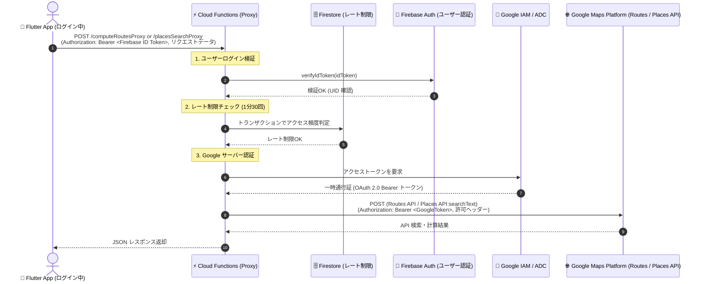

# 🗺️ 地図機能 (Map Feature)

本モジュールは、Google Maps Platform (`google_maps_flutter`)、Geolocator (`geolocator`)、および Geocoding (`geocoding`) を採用し、ネイティブ地図の表示、位置情報の動的取得・カメラ移動、住所・ランドマーク検索機能、複数候補地インタラクティブ選択モーダル、カスタムスポット（施設・ピン）のプロット、スポット詳細モーダル表示、および2点間のルート検索とナビゲーション経路描画（Polyline & RouteNavigationCard）機能を提供します。

---

## 📁 ディレクトリ構造

```plaintext
lib/src/features/map/
 ├── domain/
 │    ├── location_candidate.dart           # 検索候補地モデル (Freezed)
 │    ├── location_state.dart               # 位置情報および権限状態モデル (Sealed class)
 │    ├── map_route.dart                    # 2点間ルートモデル (Freezed)
 │    ├── map_route_state.dart              # ルート案内状態モデル (Sealed class)
 │    ├── map_search_state.dart             # 検索状態モデル (Sealed class)
 │    ├── map_spot.dart                     # カスタムスポットモデル & SpotCategory 列挙型 (Freezed)
 │    └── travel_mode.dart                  # 移動手段列挙型 (driving, walking, bicycling, transit)
 ├── data/
 │    ├── location_repository.dart          # Geolocator ネイティブAPIの安全なラッパー
 │    ├── geocoding_repository.dart         # Geocoding プラットフォームAPIの安全なラッパー
 │    ├── places_repository.dart            # Google Places API (Text Search) 検索リポジトリ (PlacesRepositoryImpl / MockPlacesRepositoryImpl)
 │    ├── polyline_decoder.dart             # Google Encoded Polyline Algorithm 座標復元デコーダー
 │    ├── route_repository.dart             # ルート検索・経路計算リポジトリ (RouteRepositoryImpl / MockRouteRepository)
 │    └── spot_repository.dart              # 周辺スポットデータ取得リポジトリ
 ├── application/
 │    ├── map_notifier.dart                 # 地図のカメラ位置・パーミッション制御 Notifier
 │    ├── map_route_notifier.dart           # ルート検索・案内状態 Notifier (競合世代管理・TravelMode対応)
 │    ├── map_search_notifier.dart          # 住所・ランドマーク検索状態 Notifier (Places API ＋ Geocoding 自動フォールバック)
 │    └── spot_notifier.dart                # カスタムスポット一覧状態 Notifier
 └── presentation/
      ├── map_screen.dart                   # ネイティブ地図描画・現在地取得UI・Floating検索バー・カスタムピン描画・Polyline描画・移動手段切り替え連携 (多言語対応)
      └── widgets/
           ├── route_navigation_card.dart   # 目的地・移動手段切り替え(車/徒歩/自転車/公共交通)・距離・所要時間・案内終了ボタン表示カード (多言語対応)
           └── spot_detail_bottom_sheet.dart# スポット詳細モーダル表示ウィジェット (多言語対応)
```

---

## 💡 仕様と設計のコアコンセプト

### 1. 安全な権限ハンドリングと状態モデル (Domain層)

`LocationState`、`MapSearchState` および `MapRouteState` に Sealed class を採用し、位置情報の取得状態（初期値、ロード中、成功、権限拒否、権限永久拒否、GPS無効、エラー）、住所検索状態（初期値、検索中、成功、該当なし、エラー）、およびルート案内状態（初期値、計算中、成功、エラー）をコンパイラレベルで厳密にモデリングしています。  
検索結果は `LocationCandidate` リスト（名称、住所、緯度経度、Place ID、カテゴリ、評価）として保持され、ルート情報は `MapRoute`（経由点リスト、距離、所要時間、境界矩形、移動手段、警告情報 warnings）としてカプセル化されています。  
また、`TravelMode` enum（車: `driving`、徒歩: `walking`、自転車: `bicycling`、公共交通: `transit`）により移動手段に応じた経路検索を厳密に管理しています。

### 2. リポジトリ層のカプセル化 (Data層)

`LocationRepository`、`GeocodingRepository`、`PlacesRepository`、`RouteRepository` および `SpotRepository` にて外部依存・通信ロジックを集約し、テスト時にモックやテスト用ハンドラを注入可能とすることで、100% 決定論的な単体・ウィジェットテストを可能にしています。

- **`PlacesRepositoryImpl`**: `BASE_URL` を元に Cloud Functions の場所検索プロキシエンドポイント（`$BASE_URL/placesSearchProxy`）と POST 通信し、Google Places API (New: `places:searchText`) 経由で複数施設・ランドマークの候補地リスト（`maxResultCount` 件まで、デフォルト10件）を取得します。
- **`MockPlacesRepositoryImpl`**: 単体テストやウィジェットテスト向けに、デフォルトで2件のダミー候補地データ（または指定されたモック候補リスト）を即座に生成するオフラインリポジトリです。
- **`RouteRepositoryImpl`**: `BASE_URL` を元に Cloud Functions のルート検索プロキシエンドポイント（`$BASE_URL/computeRoutesProxy`）と POST 通信し、指定された `TravelMode`（車: `DRIVE`、徒歩: `WALK`、自転車: `BICYCLE`、公共交通機関: `TRANSIT`）の道路ネットワークに沿った経路 Polyline、総距離、所要時間、警告情報（`warnings`）を取得します。クライアントに API キーを持たせない設計のため、ヘッダーには `X-Goog-FieldMask` のみを付与して必要なフィールドを安全・効率的に取得します。圧縮された座標文字列は `decodePolyline` ユーティリティにより `List<LatLng>` に復元されます。
- **`MockRouteRepository`**: 単体テストやウィジェットテスト向けに、2点間の緯度経度から概算距離・所要時間を計算し、5点の補間座標（折れ線）を即座に生成するオフラインリポジトリです。API キーや外部通信を一切行わずに決定論的なテストを可能にします。

### 3. 多言語対応 (Presentation層)

画面上のすべてのタイトル、ボタン、SearchBar ヒント文言、候補地選択タイトル、スポットカテゴリ名、評価ラベル、移動手段名（車/徒歩/自転車/公共交通）、ルート案内ボタン、所要時間・距離表示、案内終了ボタン、SnackBar、ダイアログ文言は `context.l10n` を使用し、日本語・英語ロケールに動的対応しています。

### 4. 住所・ランドマーク検索と複数候補地選択モーダル (Google Places API ＋ OS Geocoder フォールバック)

画面上部の Floating SearchBar から入力された住所やランドマークのキーワードを `MapSearchNotifier` が処理します。

1. **Google Places API による検索 (`PlacesRepository`)**: まず Cloud Functions プロキシ経由で Google Places API を呼び出し、キーワードに合致する複数施設・スポットの候補リスト（評価・カテゴリ情報付き）を取得します。
2. **OS Geocoding への自動フォールバック**: 万が一 Places API の通信エラーが発生した場合（エラーログ記録）や結果が 0 件だった場合（Info ログ記録）は、Talker にログを出力した上で自動的に OS 標準の `GeocodingRepository`（iOS: `CLGeocoder`、Android: `Geocoder`）へフォールバックし、検索を継続します。
3. **候補地選択ボトムシート**:
   - **候補地が1件の場合**: 自動で該当位置へカメラアニメーション移動し、マーカーをプロットします。
   - **候補地が複数件の場合**: 画面下部に `showModalBottomSheet` を表示し、施設名・住所・評価（★）を確認しながら目的の候補地を選択させます。選択された候補地へスムーズなカメラ移動とマーカープロットを行います。

### 5. カスタムプロット・ピン表示と詳細モーダル (`SpotDetailBottomSheet`)

地図上には `SpotRepository` から取得した周辺スポットが、カテゴリ別に色分けされたカスタムマーカー (`BitmapDescriptor.defaultMarkerWithHue`) としてプロットされます。

- **ピンタップ時**: タップされたスポットの中心へカメラが滑らかにフォーカス移動し、画面下部に `SpotDetailBottomSheet` が表示されます。
- **詳細表示内容**: カテゴリバッジ、スポット名称、評価（★）、住所、詳細説明文言、およびルート案内ボタンが表示されます。

### 6. 2点間ルート検索とナビゲーション経路描画 (`RouteNavigationCard` & `Polyline`)

スポット詳細モーダルから「ルート案内」ボタンを押下、または出発地と目的地を指定することで、現在地から目的地までの経路案内を開始します。

- **ルート案内データ取得 (`RouteRepositoryImpl`)**:
  - `BASE_URL`（`$BASE_URL/computeRoutesProxy`）のエンドポイントへ `dioProvider`（Firebase Auth ID トークン自動付与）経由でリクエストを送信し、Firebase Cloud Functions プロキシから安全に経路データを取得します（ローカル環境では Functions エミュレータ、stg/prod ではクラウド Functions へ接続）。
  - 単体テスト・ウィジェットテスト時は `MockRouteRepository` により、外部通信不要で即座にリアルな補間座標（折れ線）・距離・所要時間を算出します。
- **経路描画 (`Polyline`)**: 道路に沿った経由座標点（ウェイポイント）を青色の Polyline（線幅 5、丸型キャップ）として地図上に描画します。
- **カメラ自動ズーム (`LatLngBounds`)**: 経路全体が画面内に綺麗に収まるよう `CameraUpdate.newLatLngBounds(route.bounds, 64)` によるスムーズなカメラ調整を実行します。
- **案内カードオーバーレイ (`RouteNavigationCard`)**: 画面下部に配置され、目的地名称、移動手段切り替え用 `SegmentedButton`（車、徒歩、自転車、公共交通）、予想所要時間（分）、総距離（km）、折りたたみ/展開ボタン、および案内終了ボタン（×）を表示します。
  - **折りたたみ/展開（コンパクト表示/詳細表示）**: カード右上の矢印ボタンまたはコンパクトバーのタップにより、詳細表示（移動手段切り替えや警告情報）とコンパクト表示（1行にアイコン・所要時間・距離・目的地名をまとめた省スペース表示）を `AnimatedSize` による滑らかなアニメーションで切り替え可能です。
  - **検索バーフォーカス連動**: 画面上部の検索バーにフォーカスが当たった際は、ユーザーの視界と操作性を確保するため案内カードが自動的にコンパクト表示へと折りたたまれます。
  - **新規検索実行時のルート自動クリア**: 検索バーから新しい検索を実行した際は、前のルートが自動的にクリアされて新しい検索結果に集中できます。
  - **現在地取得 FAB の自動連動配置**: ルート案内カードの表示状態（非表示・コンパクト・詳細）に応じて、現在地取得 FAB がカード上部に自動でオフセット配置され、重なりを防ぎます。
  - **移動手段の即時切り替え**: 移動手段を切り替えると即座に新しい手段でのルート再計算が実行されます。案内終了ボタンを押下するとルート案内状態がクリアされ、Polyline およびカードが地図上から非表示になります。
- **徒歩・自転車ルートの安全性警告表示**: 徒歩（歩道がない可能性）や自転車（専用レーンがない可能性）のルート案内時には、カード下部に注意バナー（⚠️ アイコンと多言語対応の注意テキスト）を表示し、安全な移動を促します。API から固有の警告メッセージが返された場合はそれを優先表示します。

---

## 🛡️ パーミッション設定

### iOS (`ios/Runner/Info.plist`)

- `NSLocationWhenInUseUsageDescription`: 地図画面で現在地を表示・取得するために位置情報を使用します。
- `NSLocationAlwaysAndWhenInUseUsageDescription`: 地図画面で現在地を表示・取得するために位置情報を使用します。

### Android (`android/app/src/main/AndroidManifest.xml`)

- `android.permission.ACCESS_FINE_LOCATION` (GPS高精度)
- `android.permission.ACCESS_COARSE_LOCATION` (概算位置)

---

## 🧪 テスト仕様

- **単体・ウィジェットテスト (`test/src/features/map/`)**:
  - ドメインモデル (`location_candidate_test.dart`, `map_spot_test.dart`, `map_search_state_test.dart`, `map_route_test.dart`, `map_route_state_test.dart`, `travel_mode_test.dart`)
  - データ層 (`spot_repository_test.dart`, `location_repository_test.dart`, `geocoding_repository_test.dart`, `route_repository_test.dart`, `polyline_decoder_test.dart`)
  - アプリケーション層 (`spot_notifier_test.dart`, `map_notifier_test.dart`, `map_search_notifier_test.dart`, `map_route_notifier_test.dart`)
  - プレゼンテーション層 (`map_screen_test.dart`, `spot_detail_bottom_sheet_test.dart`, `route_navigation_card_test.dart`)
- **ゴールデンテスト (`test/src/features/map/presentation/map_screen_golden_test.dart`)**:
  - `MapScreen` (ライト/ダークモード)
  - `SpotDetailBottomSheet` (ライト/ダークモード)
  - `RouteNavigationCard` (ライト/ダークモード)

---

## 🔒 Google Maps Platform サーバープロキシ構成（Firebase Cloud Functions）

本プロジェクトでは、セキュリティの最大化（ルート検索・場所検索用の Web API キー完全撤廃・Zero-Key プロキシアーキテクチャ & ユーザーログイン認証。※ネイティブ地図描画用の MAPS_ANDROID_API_KEY / MAPS_IOS_API_KEY は引き続き必要です）を実現するため、Flutter クライアントから直接 Google API を呼ばず、**Firebase Cloud Functions によるサーバープロキシ構成** を標準採用しています。（関連 Issue: [#215](https://github.com/a-sasaoka/flutter_sample/issues/215), [#219](https://github.com/a-sasaoka/flutter_sample/issues/219)）

### 1. アーキテクチャ構成図 (Firebase Auth 認証 & IAM / ADC 認証)



### 2. クライアント側のプロキシ接続設計

Flutter アプリ側では個別 API ごとの固定 URL を持たず、環境設定 `envConfigProvider` の `BASE_URL`（詳細は [Flavor管理](./flavor.md#3-各環境の-api-接続先設計base_url-集約) を参照）にエンドポイント名を付与して安全に通信します。

- **ルート検索 (`RouteRepository`)**: `${envConfig.baseUrl}/computeRoutesProxy`
- **場所検索 (`PlacesRepository`)**: `${envConfig.baseUrl}/placesSearchProxy`

各環境（`local`, `dev`, `stg`, `prod`）の接続先や個人オーバーライド設定の詳細は [Flavor管理](./flavor.md) を参照してください。

### 3. サーバー側（Firebase Cloud Functions）のセキュリティ・中継仕様

実装コードの詳細については [`functions/src/index.ts`](../functions/src/index.ts) を参照してください。以下の安全対策を施したプロキシエンドポイント（`computeRoutesProxy` および `placesSearchProxy`）を提供しています。

1. **ログイン認証チェック**: `getUidFromRequest` による Firebase Auth ID トークンの検証（未認証は 401 遮断）。
2. **レート制限 (利用制限)**: Cloud Firestore トランザクションを用いて UID 単位で全インスタンス共通で 1分間に最大30リクエストに厳格に制限し、短時間の過剰アクセスや意図しない課金急増を防止（超過時は 429 遮断。万が一の DB 障害時はフェイルオープンで検索を継続）。
3. **入力バリデーション・ホワイトリスト再構築**: 許可パラメータのみを検証して安全な `upstreamBody` を再構築して中継（未許可項目や不正値は 400 遮断）。
4. **Google IAM / ADC 認証**: クライアントに Web サービス用 API キーを持たせず、サーバー側で安全に取得した一時通行証（OAuth 2.0 Bearer トークン）で Google 各 API へ中継。
5. **フィールドマスクの制限**: 許可されたフィールドのみを通過させ、不要なデータ取得や課金増加を防止。
6. **通信タイムアウト**: 10 秒の上限を設定し、外部 API 遅延時のサーバーハングを防止。
7. **エラーハンドリング**: 内部エラー発生時は固定の 500 メッセージ（`Internal Server Error`）を返し、詳細な例外情報はサーバーログにのみ記録。

### 4. 動作確認手順

#### A. ローカルモック環境 (`local` フレーバー)

1. `./mock/start.sh` でローカルモックサーバー（ポート 3000）を起動します。
2. `fvm flutter run --flavor local -t lib/main_local.dart --dart-define-from-file=config/flavor_local.json` で起動します。
3. 外部通信や API キー不要で、モック経由での場所検索・ルート描画が完全に動作します。

#### B. Functions エミュレータ環境 (`dev` フレーバー)

1. `gcloud auth application-default login` でログイン（初回のみ）。
2. `npm run --prefix functions build && firebase emulators:start --only functions,firestore` でエミュレータを起動します。
3. `fvm flutter run --flavor dev -t lib/main_dev.dart --dart-define-from-file=config/flavor_dev.json --dart-define-from-file=.env.dev` で起動します。
4. アプリにログイン後、マップ画面で検索バーに施設名（例: 「東京タワー」）を入力して検索し、複数候補地ボトムシートやスポット詳細から「ルート案内」ボタンをタップして正常に動作することを確認します。

> 📌 **設定適用の優先順位**:
>
> 1. `--dart-define-from-file=.env.*`（個人のローカル環境設定。指定されている場合最優先）
> 2. `--dart-define-from-file=config/flavor_*.json`（チーム共通のデフォルト設定）
>
> リリースビルド時（`stg`, `prod`）は `.env.*` で `localhost` が上書きされないよう注意し、本番のクラウド Functions URL に接続してください。
