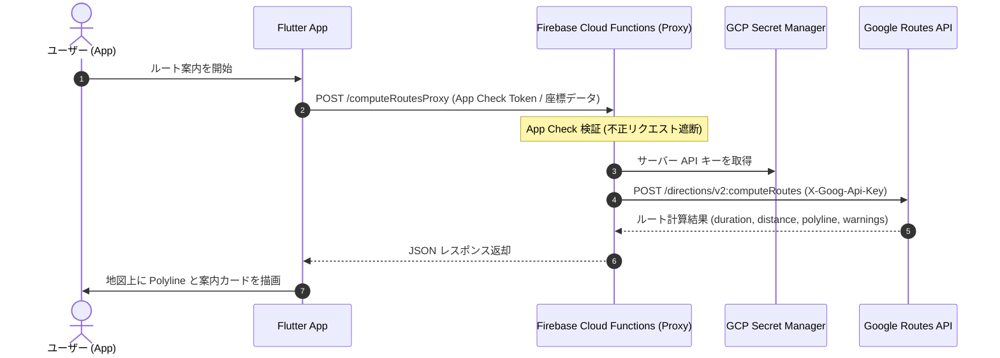

# 🗺️ 地図機能 (Map Feature)

本モジュールは、Google Maps Platform (`google_maps_flutter`)、Geolocator (`geolocator`)、および Geocoding (`geocoding`) を採用し、ネイティブ地図の表示、位置情報の動的取得・カメラ移動、住所・ランドマーク検索機能、複数候補地インタラクティブ選択モーダル、カスタムスポット（施設・ピン）のプロット、スポット詳細モーダル表示、および2点間のルート検索とナビゲーション経路描画（Polyline & RouteNavigationCard）機能を提供します。

---

## 📁 ディレクトリ構造

```plaintext
lib/src/features/map/
 ├── domain/
 │    ├── location_candidate.dart           # 検索候補地モデル (Freezed)
 │    ├── location_candidate.freezed.dart   # Freezed自動生成コード
 │    ├── location_state.dart               # 位置情報および権限状態モデル (Sealed class)
 │    ├── location_state.freezed.dart       # Freezed自動生成コード
 │    ├── map_route.dart                    # 2点間ルートモデル (Freezed)
 │    ├── map_route.freezed.dart            # Freezed自動生成コード
 │    ├── map_route_state.dart              # ルート案内状態モデル (Sealed class)
 │    ├── map_route_state.freezed.dart      # Freezed自動生成コード
 │    ├── map_search_state.dart             # 検索状態モデル (Sealed class)
 │    ├── map_search_state.freezed.dart     # Freezed自動生成コード
 │    ├── map_spot.dart                     # カスタムスポットモデル & SpotCategory 列挙型 (Freezed)
 │    ├── map_spot.freezed.dart             # Freezed自動生成コード
 │    └── travel_mode.dart                  # 移動手段列挙型 (driving, walking, bicycling, transit)
 ├── data/
 │    ├── location_repository.dart          # Geolocator ネイティブAPIの安全なラッパー
 │    ├── location_repository.g.dart        # Riverpod生成プロバイダー
 │    ├── geocoding_repository.dart         # Geocoding プラットフォームAPIの安全なラッパー
 │    ├── geocoding_repository.g.dart       # Riverpod生成プロバイダー
 │    ├── polyline_decoder.dart             # Google Encoded Polyline Algorithm 座標復元デコーダー
 │    ├── route_repository.dart             # Google Directions API ルート検索・経路計算リポジトリ (TravelMode対応)
 │    ├── route_repository.g.dart           # Riverpod生成プロバイダー
 │    ├── spot_repository.dart              # 周辺スポットデータ取得リポジトリ
 │    └── spot_repository.g.dart            # Riverpod生成プロバイダー
 ├── application/
 │    ├── map_notifier.dart                 # 地図のカメラ位置・パーミッション制御 Notifier
 │    ├── map_notifier.g.dart               # Riverpod生成 Notifier
 │    ├── map_route_notifier.dart           # ルート検索・案内状態 Notifier (競合世代管理・TravelMode対応)
 │    ├── map_route_notifier.g.dart         # Riverpod生成 Notifier
 │    ├── map_search_notifier.dart          # 住所・ランドマーク検索状態 Notifier
 │    ├── map_search_notifier.g.dart        # Riverpod生成 Notifier
 │    ├── spot_notifier.dart                # カスタムスポット一覧状態 Notifier
 │    └── spot_notifier.g.dart              # Riverpod生成 Notifier
 └── presentation/
      ├── map_screen.dart                   # ネイティブ地図描画・現在地取得UI・Floating検索バー・カスタムピン描画・Polyline描画・移動手段切り替え連携 (多言語対応)
      └── widgets/
           ├── route_navigation_card.dart   # 目的地・移動手段切り替え(車/徒歩/自転車/公共交通)・距離・所要時間・案内終了ボタン表示カード (多言語対応)
           └── spot_detail_bottom_sheet.dart# スポット詳細モーダル表示ウィジェット (多言語対応)
```

---

## 💡 仕様と設計のコアコンセプト

### 1. 安全な権限ハンドリングと状態モデル (Domain層)

`LocationState`、`MapSearchState` および `MapRouteState` に Sealed class を採用し、位置情報の取得状態（初期値、ロード中、成功、権限拒否、権限永久拒否、GPS無効、エラー）、住所検索状態（初期値、検索中、成功、該当なし、エラー）、およびルート案内状態（初期値、計算中、成功、エラー）をコンパイラレベルで厳密にモデリングしています。検索結果は `LocationCandidate` リストとして保持され、ルート情報は `MapRoute`（経由点リスト、距離、所要時間、境界矩形、移動手段）としてカプセル化されています。また、`TravelMode` enum（車: `driving`、徒歩: `walking`、自転車: `bicycling`、公共交通: `transit`）により移動手段に応じた経路検索を厳密に管理しています。

### 2. リポジトリ層のカプセル化 (Data層)

`LocationRepository`、`GeocodingRepository`、`RouteRepository` および `SpotRepository` にて外部依存・通信ロジックを集約し、テスト時にモックやテスト用ハンドラを注入可能とすることで、100% 決定論的な単体・ウィジェットテストを可能にしています。

- **`RouteRepositoryImpl`**: Google Routes API (`https://routes.googleapis.com/directions/v2:computeRoutes`) と POST 通信し、指定された `TravelMode`（車: `DRIVE`、徒歩: `WALK`、自転車: `BICYCLE`、公共交通機関: `TRANSIT`）の道路ネットワークに沿った経路 Polyline、総距離、所要時間を取得します。ヘッダーには `X-Goog-Api-Key` および `X-Goog-FieldMask` を付与し、必要なフィールドのみを効率的に取得します。圧縮された座標文字列は `decodePolyline` ユーティリティにより `List<LatLng>` に復元されます。

### 3. 多言語対応 (Presentation層)

画面上のすべてのタイトル、ボタン、SearchBar ヒント文言、候補地選択タイトル、スポットカテゴリ名、評価ラベル、移動手段名（車/徒歩/自転車/公共交通）、ルート案内ボタン、所要時間・距離表示、案内終了ボタン、SnackBar、ダイアログ文言は `context.l10n` を使用し、日本語・英語ロケールに動的対応しています。

### 4. 住所・ランドマーク検索と複数候補地選択モーダル

画面上部の Floating SearchBar から入力された住所やランドマークのキーワードを `MapSearchNotifier` が処理し、`GeocodingRepository` 経由で緯度経度座標および住所候補リスト (`LocationCandidate`) へ変換します。

- **候補地が1件の場合**: 自動で該当位置へカメラアニメーション移動し、マーカーをプロットします。
- **候補地が複数件の場合**: 画面下部に `showModalBottomSheet` を表示し、ユーザーに目的の施設・住所を選択させます。選択された候補地へスムーズなカメラ移動とマーカープロットを行います。

### 5. カスタムプロット・ピン表示と詳細モーダル (`SpotDetailBottomSheet`)

地図上には `SpotRepository` から取得した周辺スポットが、カテゴリ別に色分けされたカスタムマーカー (`BitmapDescriptor.defaultMarkerWithHue`) としてプロットされます。

- **ピンタップ時**: タップされたスポットの中心へカメラが滑らかにフォーカス移動し、画面下部に `SpotDetailBottomSheet` が表示されます。
- **詳細表示内容**: カテゴリバッジ、スポット名称、評価（★）、住所、詳細説明文言、およびルート案内ボタンが表示されます。

### 6. 2点間ルート検索とナビゲーション経路描画 (`RouteNavigationCard` & `Polyline`)

スポット詳細モーダルから「ルート案内」ボタンを押下、または出発地と目的地を指定することで、現在地から目的地までの経路案内を開始します。

- **ルート案内データ取得と環境別切り替え**:
  - **local 環境 (`Flavor.local`)**: `MockRouteRepository` により、API キーおよび外部通信不要で即座にリアルな補間座標（折れ線）・距離・所要時間を算出し、オフラインで快適に開発・動作確認を行えます。
  - **dev / stg / prod 環境**: `RouteRepositoryImpl` がプロキシサーバー（Firebase Cloud Functions）へリクエストを送信し、安全に Google Routes API の結果を取得します。
- **経路描画 (`Polyline`)**: 道路に沿った経由座標点（ウェイポイント）を青色の Polyline（線幅 5、丸型キャップ）として地図上に描画します。
- **カメラ自動ズーム (`LatLngBounds`)**: 経路全体が画面内に綺麗に収まるよう `CameraUpdate.newLatLngBounds(route.bounds, 64)` によるスムーズなカメラ調整を実行します。
- **案内カードオーバーレイ (`RouteNavigationCard`)**: 画面上部に目的地名称、移動手段切り替え用 `SegmentedButton`（車、徒歩、自転車、公共交通）、予想所要時間（分）、総距離（km）、および案内終了ボタン（×）を表示します。移動手段を切り替えると即座に新しい手段でのルート再計算が実行されます。案内終了ボタンを押下するとルート案内状態がクリアされ、Polyline およびカードが地図上から非表示になります。
- **徒歩・自転車ルートの安全性警告表示**: 徒歩（歩道がない可能性）や自転車（専用レーンがない可能性）のルート案内時には、カード下部に注意バナー（⚠️ アイコンと多言語対応の注意テキスト）を表示し、安全な移動を促します。API から固有の警告メッセージが返された場合はそれを優先表示します。

---

## 🛡️ パーミッション設定

### iOS (`ios/Runner/Info.plist`)

- `NSLocationWhenInUseUsageDescription`: 地図画面で現在地を表示・取得するために位置情報を使用します。
- `NSLocationAlwaysAndWhenInUseUsageDescription`: 地図画面で現在地を表示・取得するために位置情報を使用します。

### Android (`android/app/src/main/AndroidManifest.xml`)

- `android.permission.ACCESS_FINE_LOCATION` (GPS高精度)
- `android.permission.ACCESS_COARSE_LOCATION` (概算位置)

---

## 🧪 テスト仕様

- **単体・ウィジェットテスト (`test/src/features/map/`)**:
  - ドメインモデル (`map_spot_test.dart`, `map_search_state_test.dart`, `map_route_test.dart`, `map_route_state_test.dart`, `travel_mode_test.dart`)
  - データ層 (`spot_repository_test.dart`, `location_repository_test.dart`, `geocoding_repository_test.dart`, `route_repository_test.dart`, `polyline_decoder_test.dart`)
  - アプリケーション層 (`spot_notifier_test.dart`, `map_notifier_test.dart`, `map_search_notifier_test.dart`, `map_route_notifier_test.dart`)
  - プレゼンテーション層 (`map_screen_test.dart`, `spot_detail_bottom_sheet_test.dart`, `route_navigation_card_test.dart`)
- **ゴールデンテスト (`test/src/features/map/presentation/map_screen_golden_test.dart`)**:
  - `MapScreen` (ライト/ダークモード)
  - `SpotDetailBottomSheet` (ライト/ダークモード)
  - `RouteNavigationCard` (ライト/ダークモード)

---

## 🚀 将来の拡張: Google Routes API サーバープロキシ化ガイド（Firebase Cloud Functions）

本番運用（ストア公開）やセキュリティの最大化を見据え、クライアント直接通信から **Firebase Cloud Functions によるサーバープロキシ構成** へ移行するための設計・実装ガイドです。（関連 Issue: [#219](https://github.com/a-sasaoka/flutter_sample/issues/219)）

### 1. アーキテクチャ構成図



### 2. サーバー側（Firebase Cloud Functions）実装例 (TypeScript)

```typescript
import { onRequest } from "firebase-functions/v2/https";
import { defineSecret } from "firebase-functions/params";
import axios from "axios";

// GCP Secret Manager で安全に管理される Google Maps サーバー API キー
const mapsServerApiKey = defineSecret("MAPS_SERVER_API_KEY");

export const computeRoutesProxy = onRequest(
  {
    secrets: [mapsServerApiKey],
    cors: false, // Flutter モバイルアプリからの通信に限定
    enforceAppCheck: true, // Firebase App Check によるエンドポイント保護
  },
  async (req, res) => {
    try {
      if (req.method !== "POST") {
        res.status(405).json({ error: "Method Not Allowed" });
        return;
      }

      const apiKey = mapsServerApiKey.value();
      const fieldMask =
        req.headers["x-goog-fieldmask"] ||
        "routes.duration,routes.distanceMeters,routes.polyline.encodedPolyline,routes.warnings";

      const googleResponse = await axios.post(
        "https://routes.googleapis.com/directions/v2:computeRoutes",
        req.body,
        {
          headers: {
            "Content-Type": "application/json",
            "X-Goog-Api-Key": apiKey,
            "X-Goog-FieldMask": fieldMask,
          },
        },
      );

      res.status(200).json(googleResponse.data);
    } catch (error: any) {
      const status = error.response?.status || 500;
      const data = error.response?.data || { error: error.message };
      res.status(status).json(data);
    }
  },
);
```

### 3. Flutter アプリ側の移行手順

1. **API キーの完全削除**:
   - `config/flavor_*.json`、`env.example`、`lib/src/core/config/env_config.dart` から `MAPS_API_KEY` を削除します（クライアントには Native Maps SDK 用の `MAPS_ANDROID_API_KEY` / `MAPS_IOS_API_KEY` のみ残します）。
2. **`RouteRepositoryImpl` の簡素化**:
   - `apiKey` 引数および `headers['X-Goog-Api-Key']` 付与処理を削除します。
3. **エンドポイント設定の切り替え**:
   - 各 Flavor 設定ファイル（`config/flavor_dev.json` 等）の `GOOGLE_DIRECTIONS_API_URL` にデプロイされた Cloud Functions の URL を指定します。

   ```json
   {
     "GOOGLE_DIRECTIONS_API_URL": "https://us-central1-your-project.cloudfunctions.net/computeRoutesProxy"
   }
   ```
