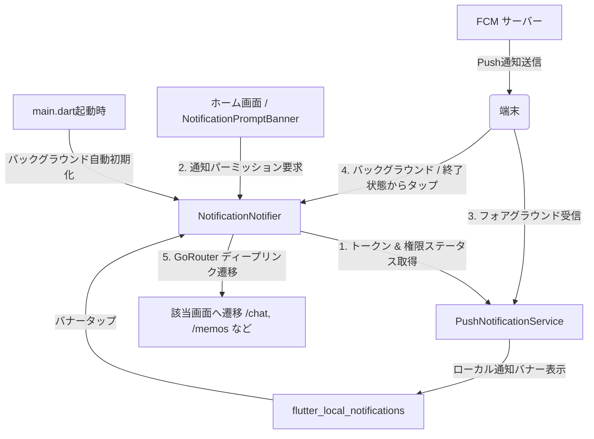
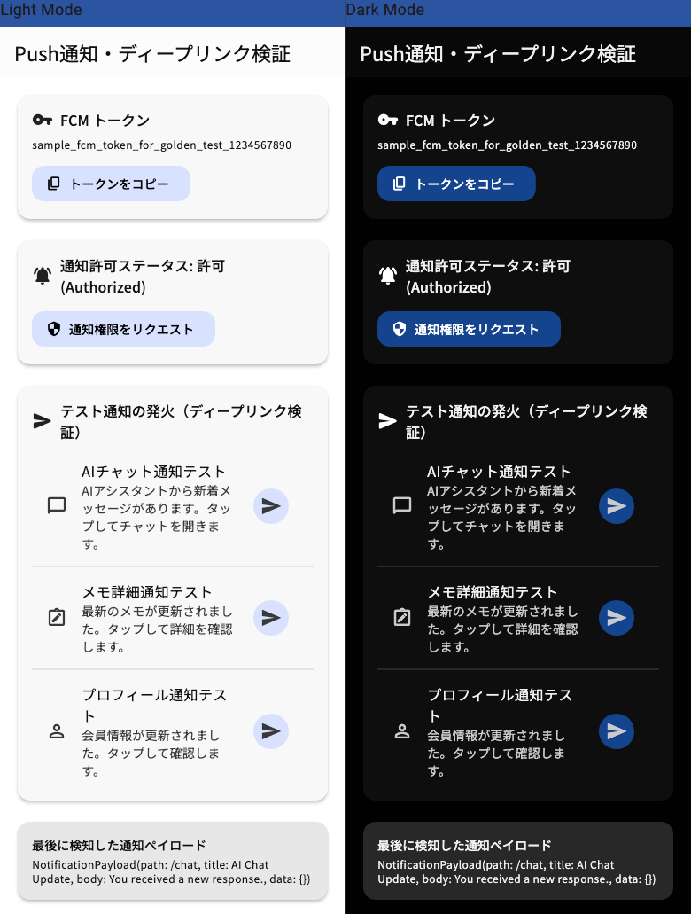

# 🔔 Push通知 & ディープリンク連携仕様書 (Push Notification & Deep Link)

このドキュメントでは、**Firebase Cloud Messaging (FCM)** と **ローカル通知 (`flutter_local_notifications`)** を使ったPush通知の受信、バナー表示、およびタップ時の **GoRouter ディープリンク画面遷移** の仕組みを解説します。

---

## 1. 概要とアーキテクチャ

アプリがフォアグラウンド（開いている状態）、バックグラウンド（裏で動いている状態）、または終了している状態のいずれであっても、通知を受け取り、通知をタップした際に指定された画面へ自動で遷移（ディープリンク）できる基盤を構築しています。



### 主な特徴

1. **アプリ起動時の自動初期化**: `mainCommon` でバックグラウンド初期化を開始し、UI描画を妨げずにトークン取得・通知リスナー・タップ待機を準備。
2. **ホーム画面プロンプトバナー (`NotificationPromptBanner`)**: 通知が未許可（未設定または拒否）のユーザーに対して、ホーム画面上部で自然に許可や設定誘導を促す控えめな案内バナーを提供。
3. **FCM & ローカル通知の統合管理**: `PushNotificationService` が通知の受信・チャンネル設定・バナー表示を一括管理。
4. **多言語化（ARB）完全対応**: 通知チャンネル名・説明・デフォルト通知文言を `app_ja.arb` / `app_en.arb` で動的に切り替え。
5. **Freezed Sealed Union 状態管理**: `NotificationState`（`loading`, `data`, `error`）により安全な状態遷移を実現。
6. **型安全なディープリンク遷移**: 通知のデータペイロードに含まれる `path`（例: `/chat`, `/memos`）を検知し、GoRouter で自動ルーティング。
7. **開発者向け検証メニュー**: `/dev-tools/notification` から実機・シミュレータでトークンコピー、権限リクエスト、テスト通知発火が可能。

---

## 2. ディレクトリ構成

Feature-Driven Architecture に従い、`lib/src/features/notification/` に機能を集約しています。

```text
lib/src/features/notification/
├── application/
│   ├── notification_notifier.dart                  # 通知の状態管理 & ディープリンク画面遷移処理
│   └── notification_state.dart                     # Freezed Sealed Union 状態モデル
├── data/
│   ├── firebase_messaging_background_handler.dart  # バックグラウンドメッセージ用トップレベルハンドラ
│   ├── push_notification_service.dart              # FCM / ローカル通知の低レイヤー制御
│   └── push_notification_service_provider.dart     # 多言語化テキスト注入プロバイダ
└── domain/
    └── notification_payload.dart                    # 通知ペイロード（path, title, body 等）モデル
```

---

## 3. 主要クラスとコード解説

### 1. `NotificationPayload` (ドメインモデル)

通知の表示メタデータ（タイトル・本文）およびデータ部（`data`）に含まれる遷移先パスやカスタムデータを統合して保持するイミュータブルなデータモデルです。実装詳細は [notification_payload.dart](../lib/src/features/notification/domain/notification_payload.dart) を参照してください。

- **通知メタデータ (`title` / `body`)**: FCM の `message.notification` やローカル通知から渡される、ユーザー向けの表示用テキストです。`NotificationPayload.fromMap()` の名前付き引数経由で設定されます。
- **データペイロード (`path` / `data`)**: FCM の `message.data` に含まれるカスタムデータです。画面遷移パスや追加パラメータが保持されます。

> **💡 ペイロードキーの柔軟な解決 (`_readPath`)**:
> FCM ペイロードのデータ部（`data`）において、`path`, `route`, `deep_link` のいずれのキーでパスが指定されていても、`_readPath` により自動的に前後の空白を除去した上で `path` フィールドへマッピングされます。また、`fromMap` を介して `data` マップ全体も安全に保持されます。

### 2. `PushNotificationService` (データ層)

Firebase Messaging と `FlutterLocalNotificationsPlugin` のやり取りをラップします。実装詳細は [push_notification_service.dart](../lib/src/features/notification/data/push_notification_service.dart) を参照してください。

- **フォアグラウンド受信時**: `FirebaseMessaging.onMessage` を検知し、ローカル通知（高優先度バナー）を即座に表示します。
- **バックグラウンド・終了時のデータ受信**: `mainCommon` の `Firebase.initializeApp()` 直後に `@pragma('vm:entry-point')` のトップレベルハンドラ `firebaseMessagingBackgroundHandler` が登録され、バックグラウンドでのメッセージ受信時に呼び出されます（※独立した Isolate で動作するため、UI 操作や Riverpod による状態管理は行えません）。
- **通知タップ時**: `onNotificationTap` コールバックを通じて `NotificationPayload` を上位（Notifier）へ伝達します。
- **アプリ終了状態からの起動時**: `getInitialNotification()` により Firebase 及びローカル通知の起動情報を取得し、初期通知ペイロードとして保持します。
- **Android ネイティブ高重要度チャンネル初期化**: アプリ未起動（terminated）状態でのFCM通知受信時にも高重要度（バナー/サウンド）で確実に表示されるよう、`MainApplication.kt` の `onCreate()` で `high_importance_channel` をネイティブ初期化しています。

### 3. `NotificationNotifier` (アプリケーション層)

Riverpod の `@Riverpod(keepAlive: true)` Notifier として動作し、FCMトークンの取得や通知状態の管理・更新を担当します（実際のディープリンク画面遷移はルーターリスナーが実行します）。実装詳細は [notification_notifier.dart](../lib/src/features/notification/application/notification_notifier.dart) を参照してください。

- **初期化 (`_init`)**: トークン取得、権限ステータス確認、アプリ起動時通知（`initialPayload`）の取得を非同期で実行します。
- **ペイロード消費 (`consumeInitialPayload` / `consumeLatestPayload`)**: 画面遷移処理の重複を防ぐため、一度遷移に使われたペイロードをクリア（消費）します。
- **通知タップ処理 (`handleNotificationTap`)**: 通知タップ時にペイロードを受け取り、状態（`latestPayload`, `lastReceivedPayload`）を更新します。非同期初期化中のタップは一時バッファリングされます。

> **💡 アーキテクチャのポイント (単方向データフロー & 確認用履歴の保持)**:
> `NotificationNotifier` はルーター（`routerProvider`）に直接依存せず、状態の更新のみを担当します。画面遷移トリガー用の `latestPayload` は `app_router.dart` の `ref.listen` によって二重遷移防止のために即座に消費（`consumeLatestPayload()`）されますが、確認・デバッグ専用の `lastReceivedPayload` は消去されずに保持されるため、画面遷移後もデモ画面等で直近の通知ペイロードを安全に確認できます。また、非同期初期化中に発生した通知タップもバッファリングされ、初期化完了時に安全に画面遷移がトリガーされます。

---

## 4. 開発者メニュー（Push通知デモ画面）

開発・動作確認用に `/dev-tools/notification`（`PushNotificationDemoScreen`）が用意されています。



- **FCM トークン確認 & コピー**: 端末の FCM トークンを表示し、ワンタップでクリップボードへコピー（SnackBar 表示）。
- **通知権限リクエスト**: 現在の権限ステータス（許可 / 拒否 / 仮許可 / 未設定）を確認し、OS のパーミッションダイアログを要求。
- **テスト通知発火（ディープリンク検証）**:
  - 💬 **AIチャット通知テスト**: バナーをタップすると `/chat` へ遷移
  - 📝 **メモ詳細通知テスト**: バナーをタップすると `/memos` へ遷移
  - 👤 **プロフィール通知テスト**: バナーをタップすると `/settings/profile` へ遷移

---

## 5. テスト仕様

- **単体テスト (`checks`)**:
  - `NotificationPayload`: JSON 変換、Map 変換の完全性テスト
  - `PushNotificationService`: `FakeFlutterLocalNotificationsPlugin` を用いた初期化、フォアグラウンド受信、通知タップ、エラーハンドリングのテスト
  - `NotificationNotifier`: トークン自動リフレッシュ、パーミッション要求、テスト通知発火、ディープリンク遷移のテスト
  - `pushNotificationServiceProvider`: Firebase 未初期化環境での安全なフォールバックテスト
- **ウィジェットテスト**: `PushNotificationDemoScreen` のローディング、エラー、データ表示、コピー操作、各テスト通知ボタン押下の完全網羅
- **ゴールデンテスト**: `PushNotificationDemoScreenGoldenTest`（ライト / ダークモード）
- **カバレッジ**: 通知機能関連ファイル **100%**

---

## 6. 動作確認手順 (Verification Guide)

### 🚀 1. アプリ内でのテスト通知・ディープリンク確認（Firebase設定不要）

特別な Firebase の追加設定なしで、シミュレータや実機ですぐに動作確認が可能です。

#### A. ホーム画面プロンプトバナーでの権限リクエスト確認

1. 通知が未許可（初期状態）の状態でホーム画面を開きます。
2. 画面上部に **「通知をオンにして最新情報を受け取ろう」** の案内バナーが表示されることを確認します。
3. **「通知をオンにする」** ボタンをタップし、OSの「通知を許可しますか？」ダイアログが表示されることを確認します（許可後はバナーが自動で非表示になります）。
4. 通知が拒否（denied）されている場合は **「設定を開く」** ボタンが表示され、タップするとOSの設定画面へ遷移できることを確認します。

#### B. 開発者画面でのテスト通知 & ディープリンク確認

1. アプリを起動し、ホーム画面の **「🔔 Push通知・ディープリンク検証」** をタップします。
2. 上部のステータスに現在の権限（`許可 (Authorized)` など）が表示されていることを確認します。
3. **「AIチャット通知テスト」** または **「メモ詳細通知テスト」** ボタンをタップします。
4. 画面上部にローカル通知バナーが表示されます。
5. バナーをタップすると、自動で `/chat` や `/memos` 画面へ遷移（ディープリンク）することを確認します。

---

### 📱 2. Firebase Console からの FCM Push通知テスト（Firebase設定が必要）

Firebase Console から直接 Push 通知を送信して実機で受信確認を行う手順です。

#### 事前準備

- **Android**: `android/app/google-services.json` が配置されていること。
- **iOS**:
  - Apple Developer Program（有料）の APNs 認証キー（`.p8`）が Firebase Console に登録されていること（実機受信の場合）。
  - Xcode（`ios/Runner.xcworkspace`）の **Runner** ターゲット ➔ **Signing & Capabilities** にて **「Push Notifications」** 機能（Capability）が追加されていること（`Runner.entitlements` の生成）。

#### 送信テスト手順

1. アプリを起動し、`/dev-tools/notification` 画面を開きます。
2. 表示されている **FCM トークン** の「コピー」ボタンをタップします。
3. [Firebase Console](https://console.firebase.google.com/) ➔ **「Run」** ➔ **「Messaging」** を開きます。
4. **「新しいキャンペーン」** ➔ **「通知」** を選択します。
5. タイトルと本文を入力し、**「テストメッセージを送信」** をクリックします。
6. コピーした FCM トークンを貼り付けて追加し、**「テスト」** を実行します。
7. （ディープリンク検証を行う場合）追加データに キー: `path`、値: `/chat` などを指定して送信し、通知タップで画面遷移することを確認します。

---

### 🛡️ 3. Firebase 未接続環境でのセーフガード

Firebase が初期化されていない環境（Local Flavor や一部のテスト環境など）でも、`Firebase.apps.isNotEmpty` による自動セーフガードが働くため、アプリがクラッシュすることなく安全に動作します。
