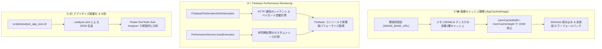
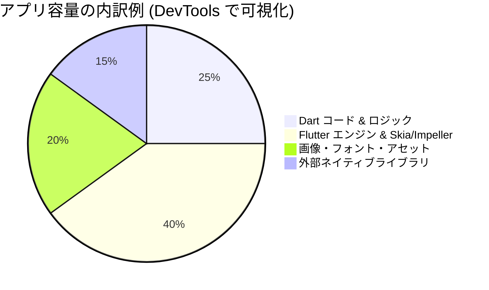

# ⚡️ パフォーマンス最適化・監視ガイド (Performance Optimization & Monitoring)

このドキュメントでは、本プロジェクトにおける **「① 画像キャッシュ戦略」「② Firebase Performance Monitoring」「③ アプリサイズ軽量化」** の3大パフォーマンス施策について、アーキテクチャや仕組み、実装方法を初心者にもわかりやすく解説します。

---

## 🎯 全体像とアーキテクチャ



---

## 1. 🖼️ 画像キャッシュ戦略 (Image Caching Strategy)

### 💡 なぜ画像キャッシュが必要なのか？

Flutter アプリでネットワーク画像を毎回そのままダウンロードして描画すると、以下の重大な問題が発生します：

1. **通信量の増大**: 同じ画像を何度もダウンロードするため、ユーザーのギガや通信帯域を圧迫します。
2. **描画の遅延・ちらつき**: 画面を開くたびに画像読み込みが発生し、UIの滑らかさが損なわれます。
3. **メモリ不足（OOM: Out Of Memory）クラッシュ**: 高解像度の画像をそのままメモリ（RAM）に読み込むと、メモリを数十〜数百MB消費してアプリが強制終了します。

本プロジェクトでは、`cached_network_image` と `flutter_cache_manager` をベースに、これらの問題をすべて解決する共通ウィジェット [`AppCachedImage`](../lib/src/core/widgets/app_cached_image.dart) を提供しています。

### 📁 関連ファイル

- [`lib/src/core/widgets/app_cached_image.dart`](../lib/src/core/widgets/app_cached_image.dart): 画像キャッシュ・メモリ最適化・フォールバックを担う共通ウィジェット
- [`lib/src/core/storage/image_cache_service.dart`](../lib/src/core/storage/image_cache_service.dart): メモリおよびディスクの画像キャッシュを一括消去する管理サービス
- [`lib/src/features/dev_tools/presentation/image_cache_demo_screen.dart`](../lib/src/features/dev_tools/presentation/image_cache_demo_screen.dart): 開発者ツール内の画像キャッシュ動作確認デモ画面

### 🚀 主な機能と実装のポイント

#### ① メモリ（RAM）使用量の自動最適化

表示領域（`width` / `height`）と端末の `devicePixelRatio`（ピクセル密度）から、**実際に必要なピクセル数だけをメモリにデコード**（`memCacheWidth` / `memCacheHeight`）します。
4Kなどの巨大な画像（非最適化時のメモリ展開 約33MB）が指定されても、メモリ消費を最小限（150×150px のアイコンなら約90KB程度 = 150×150×4バイト）に抑えられます。

```dart
// 例: 幅50px、高さ50px、画面密度 3.0 の場合 -> 150px × 150px でメモリ展開
AppCachedImage.circle(
  imageUrl: user.avatarUrl,
  size: 48,
)
```

#### ② 形状のバリエーション（Dart 3 パターン対応）

- `AppCachedImage(...)`: 通常の四角形
- `AppCachedImage.rounded(...)`: 角丸（`borderRadius` 指定可能）
- `AppCachedImage.circle(...)`: 円形アバター表示（正円クリップ）

#### ③ Shimmer（骨組みアニメーション）と安全なフォールバック

- **読み込み中**: スケルトン（Shimmer）アニメーションを表示（テスト実行時は Golden テストの安定化のため自動で静止表示になります）。
- **未設定（URLが null または空文字）**: 人物アイコンなどのデフォルトアイコンを表示。
- **読み込み失敗時**: 壊れた画像アイコンを表示しつつ、予期せぬ例外を `Talker` 経由で Crashlytics に Non-fatal Error として記録。

#### ④ キャッシュの一括クリア（`ImageCacheService`）

ユーザーがログアウトした際や開発中の動作確認で、メモリ上のキャッシュと端末ストレージ（ディスク）上の画像キャッシュを一括削除できます。

```dart
// キャッシュ一括クリアの実行
await ref.read(imageCacheServiceProvider).clearCache();
```

---

## 2. ⚡️ Firebase Performance Monitoring

### 💡 なぜ実環境のパフォーマンス監視が必要なのか？

開発端末（Wi-Fi接続、高性能Mac/スマホ）では快適に動作していても、本番環境のユーザーは低速なモバイル回線や低スペック端末など、多様な環境でアプリを利用します。
`firebase_performance` を導入することで、**実際のユーザー環境での「HTTP 通信の遅延」や「画面表示・処理時間」を自動でリアルタイム収集・可視化**できます。

### 📁 関連ファイル

- [`lib/src/core/performance/firebase_performance_provider.dart`](../lib/src/core/performance/firebase_performance_provider.dart): `FirebasePerformance` インスタンスを提供するプロバイダー（未初期化時の安全な null ガード付き）
- [`lib/src/core/performance/performance_service.dart`](../lib/src/core/performance/performance_service.dart): 任意の非同期処理の実行時間を計測するカスタムトレースヘルパー
- [`lib/src/core/network/firebase_performance_dio_interceptor.dart`](../lib/src/core/network/firebase_performance_dio_interceptor.dart): Dio の全通信を自動計測するインターセプター
- [`lib/src/core/network/dio_provider.dart`](../lib/src/core/network/dio_provider.dart): Dio へのインターセプター自動登録

### 🚀 主な機能と使い方

#### ① Dio 通信の完全自動計測（`HttpMetric`）

すべての Dio リクエストに対して、以下の指標が自動で Firebase Performance に送信されます：

- **URL & HTTP メソッド**（GET, POST, PUT, DELETE, PATCH 等）
- **通信レイテンシ（所要時間）**
- **HTTP レスポンスステータスコード**（200, 404, 500 等）
- **リクエスト / レスポンスのペイロードサイズ（バイト数）**
- **Content-Type**

開発者が個別の API 通信コードに計測処理を書く必要はなく、Dio を使って通信するだけで自動計測されます。

#### ② 任意の非同期処理を測る「カスタムトレース」（`PerformanceService`）

重いデータ処理や初期化処理などの実行時間を計測したい場合、`PerformanceService.traceExecution` で囲むだけで簡単に計測できます。

```dart
final performanceService = ref.read(performanceServiceProvider);

final result = await performanceService.traceExecution(
  traceName: 'heavy_data_processing',
  attributes: {'category': 'financial'},
  metrics: {'item_count': 100},
  action: () async {
    // 計測したい非同期処理
    return await processHeavyData();
  },
);
```

---

## 3. 📦 アプリサイズ軽量化 & 分析 (App Size Optimization)

### 💡 アプリサイズを小さく保つ重要性

- アプリのダウンロードサイズが大きいと、ユーザーのインストール離脱率が急上昇します。
- 携帯キャリアのセルラー通信ダウンロード制限（200MB等）に引っかかるリスクを回避します。

### 🛠️ サイズ分析スクリプトの使い方

プロジェクトルートに配置された [`scripts/analyze_app_size.sh`](../scripts/analyze_app_size.sh) を使用して、ビルドごとの詳細なサイズ分析 JSON ファイルを生成できます。

```bash
# Android (AppBundle / prod環境) のサイズを分析
./scripts/analyze_app_size.sh android prod

# iOS (IPA / prod環境) のサイズを分析
./scripts/analyze_app_size.sh ios prod
```

### 📊 Flutter DevTools Size Analyzer での可視化手順

1. 以下のコマンドで Flutter DevTools を起動します：

   ```bash
   fvm dart devtools
   ```

2. ブラウザで開いた DevTools 画面上部の **「App Size」** タブをクリックします。
3. スクリプト実行によって `build/size_analysis/` フォルダに出力された JSON ファイル（例: `size_analysis_android_prod_20260830_120000.json`、または `~/.flutter-devtools/app-size-analysis-*.json`）をドラッグ＆ドロップで読み込みます。
4. **ツリーマップ（Treemap）表示**により、どのパッケージやアセット（画像・フォント）がアプリ容量の大半を占めているかを視覚的に特定できます。



### 💡 実践的な軽量化のベストプラクティス

1. **不要なパッケージの排除**: 使っていない依存パッケージを定期的に整理する。
2. **画像の WebP 化・SVG 化**: PNG や JPG を高圧縮率な WebP 形式に変換するか、ベクター画像（SVG）を活用する。
3. **フォントサブセット化**: 日本語フォントなどの巨大な TTF ファイルは、使用する文字のみに絞り込む（Subsetting）。
4. **Android App Bundle (`.aab`) の採用**: ユーザーの端末（CPUアーキテクチャ・画面解像度）に最適化された最小限の APK のみを配信する。

---

## 🔗 関連ドキュメント

- [APIキャッシュと永続化の設計](./cache.md)
- [環境分け (Flavor) の設定と運用](./flavor.md)
- [採用技術スタック一覧](./tech_stack.md)
