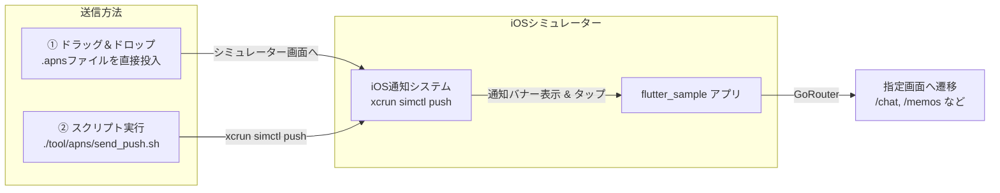

# 🔔 iOSシミュレーター リモートプッシュ通知（APNs）検証ガイド

このディレクトリ（`tool/apns/`）には、iOSシミュレーター上で **リモートプッシュ通知の受信・バナー表示・ディープリンク画面遷移** を手軽に検証するためのサンプルファイルと送信スクリプトが用意されています。

実機や有料の Apple Developer アカウント（APNs 証明書）がなくても、本番とまったく同じプッシュ通知の動作をシミュレーター上で再現・テストできます。

---

## 💡 1. APNsシミュレーションの仕組み（やさしい解説）

### APNsファイルとは？

- **APNs（Apple Push Notification service）** は、iPhone などの iOS 端末にプッシュ通知を届ける Apple 公式の仕組みです。
- 通常はサーバーから Apple の APNs サーバーを経由して端末へ通知が送られますが、**iOSシミュレーターでは `.apns` という形式のファイルを使うことで、シミュレーター内部で本物のプッシュ通知が届いた時と同じ処理を実行** させることができます。



---

## 📁 2. ディレクトリ構成

```plaintext
tool/apns/
├── README.md              # 本ドキュメント（検証手順書）
├── send_push.sh           # 通知送信スクリプト（対話型 / CLI両対応）
├── chat_local.apns        # AIチャット画面（/chat）への遷移サンプル
├── memos_local.apns       # メモ一覧画面（/memos）への遷移サンプル
├── profile_local.apns     # プロフィール設定画面（/settings/profile）への遷移サンプル
└── template.apns          # 自由にカスタマイズできる汎用テンプレート
```

---

## 🛠️ 3. 事前準備

1. **iOSシミュレーターの起動とアプリ実行**:
   VSCode またはターミナルから、アプリを local フレーバーで起動します。

   ```bash
   fvm flutter run --flavor local -t lib/main_local.dart --dart-define-from-file=config/flavor_local.json --dart-define-from-file=.env.local
   ```

2. **通知権限の許可**:
   - アプリ初回起動時にホーム画面上部に表示される「通知をオンにして最新情報を受け取ろう」バナーから **「通知をオンにする」** をタップして許可します。
   - または、ホーム画面の **「🔔 Push通知・ディープリンク検証」**（`/dev-tools/notification`）から **「通知権限をリクエスト」** を実行してください。

---

## 🚀 4. 検証方法

### 方法 A: ドラッグ＆ドロップで送信（一番かんたん）

Finder または VSCode のファイルツリーから、以下の `.apns` ファイルを**起動中の iOS シミュレーターの画面上へマウスでドラッグ＆ドロップ** します。

- 💬 `tool/apns/chat_local.apns` ➔ AIチャット画面（`/chat`）が開きます
- 📝 `tool/apns/memos_local.apns` ➔ メモ一覧画面（`/memos`）が開きます
- 👤 `tool/apns/profile_local.apns` ➔ プロフィール設定画面（`/settings/profile`）が開きます

---

### 方法 B: 送信スクリプト（`send_push.sh`）で送信

ターミナルから以下のコマンドを実行します。

#### 1. 対話型メニューモード（おすすめ）

引数なしで実行すると、メニューから番号を選ぶだけで簡単に送信できます。

```bash
./tool/apns/send_push.sh
```

**実行の流れ**:

```plaintext
==================================================
🔔 iOS シミュレーター Push 通知送信メニュー
==================================================

【1/4】送信対象の環境（フレーバー）を選択してください:
  1) local (jp.example.sample.local) [推奨・デフォルト]
  2) dev   (jp.example.sample.dev)
  3) stg   (jp.example.sample.stg)
  4) prod  (jp.example.sample)
選択 (1-4, デフォルト: 1): 1

【2/4】通知タップ時の遷移先画面を選択してください:
  1) 💬 AIチャット画面 (/chat) [デフォルト]
  2) 📝 メモ一覧画面 (/memos)
  3) 👤 プロフィール設定画面 (/settings/profile)
  4) ⚙️  設定画面 (/settings)
  5) ✏️  カスタムパスを自由入力
選択 (1-5, デフォルト: 1): 1

【3/4】通知タイトルを入力 (デフォルト: 💬 AIチャット通知):
【4/4】通知本文を入力 (デフォルト: AIアシスタントから新しいメッセージが届きました。):

🚀 プッシュ通知を iOS シミュレーターへ送信中...
✅ プッシュ通知の送信が完了しました！
```

#### 2. CLI 引数指定モード（ショートカット実行）

```bash
# AIチャット画面宛てに送信
./tool/apns/send_push.sh -p /chat -t "チャット通知" -b "新しい返信があります"

# メモ一覧画面宛てに送信
./tool/apns/send_push.sh -p /memos

# プロフィール設定画面宛てに送信
./tool/apns/send_push.sh -p /settings/profile

# dev 環境のシミュレーター宛てに送信
./tool/apns/send_push.sh -f dev -p /chat

# 既存の .apns ファイルを直接指定して送信
./tool/apns/send_push.sh --file tool/apns/memos_local.apns
```

---

## 🧪 5. テストすべき3つの動作シナリオ

プッシュ通知の動作確認では、以下の3つのアプリ状態でテストを行うことが重要です。

| #     | アプリの状態                                                      | テスト手順                                                                                     | 期待される動作                                                                               |
| :---- | :---------------------------------------------------------------- | :--------------------------------------------------------------------------------------------- | :------------------------------------------------------------------------------------------- |
| **1** | **フォアグラウンド**<br/>（アプリを開いている状態）               | アプリを開いたまま通知を送信する                                                               | 画面上部にバナーが表示され、バナーをタップすると指定の画面へ遷移する                         |
| **2** | **バックグラウンド**<br/>（ホーム画面や別アプリ表示中）           | シミュレーターのホームボタンを押してホーム画面に戻った状態で通知を送信する                     | OSの通知センター・バナーが表示され、タップするとアプリが復帰して指定画面へ遷移する           |
| **3** | **終了状態（コールドスタート）**<br/>（アプリを完全終了した状態） | シミュレーターのアプリスイッチャーからアプリを上にスワイプして完全終了した状態で通知を送信する | 通知バナーが表示され、タップするとアプリが起動 ➔ スプラッシュ画面を通過 ➔ 指定画面が直接開く |

---

## 📝 6. APNsファイルのフォーマット解説

`.apns` ファイルは以下のような JSON 構造になっています。

```json
{
  "Simulator Target Bundle": "jp.example.sample.local",
  "aps": {
    "alert": {
      "title": "通知タイトル",
      "body": "通知の本文テキスト"
    },
    "badge": 1,
    "sound": "default"
  },
  "gcm.message_id": "sim_chat_001",
  "path": "/chat",
  "payload": "{\"path\":\"/chat\"}"
}
```

### 主要キーの説明

- **`Simulator Target Bundle`**: ドラッグ＆ドロップ時に通知を届けるアプリの **Bundle Identifier** です（必須）。
  - `local`: `jp.example.sample.local`
  - `dev`: `jp.example.sample.dev`
  - `stg`: `jp.example.sample.stg`
  - `prod`: `jp.example.sample`
- **`aps`**: Apple 標準の通知情報オブジェクトです。
  - `alert.title`: 通知のタイトル
  - `alert.body`: 通知の本文
  - `badge`: アプリアイコン右上に表示するバッジ番号
  - `sound`: 通知音（`"default"`）
- **`gcm.message_id`**: **Firebase Messaging にリモート通知として認識させるための必須キー**です（任意の文字列でOK）。これがないと、終了（Kill）状態からのタップ時に Firebase が通知を無視してしまいます。
- **`path`**: アプリ内で遷移させたい **GoRouter の画面パス**（例: `/chat`, `/memos`, `/settings/profile`）です。
- **`payload`**: **iOSシミュレーターのバックグラウンド通知タップ時にローカル通知プラグインへ渡すためのキー**です（`"{\"path\":\"/chat\"}"` 形式）。

---

## ❓ 7. トラブルシューティング

### Q1. 通知が届かない / バナーが表示されない

- **原因1**: シミュレーターで通知権限が許可されていない可能性があります。
  - **解決策**: アプリ内の「🔔 Push通知・ディープリンク検証」画面で権限が `許可 (Authorized)` になっているか確認してください。
- **原因2**: `.apns` ファイル内の `"Simulator Target Bundle"` と、起動中のアプリの Bundle ID が一致していません。
  - **解決策**: local フレーバーで起動している場合は `jp.example.sample.local` になっているか確認してください。

### Q2. アプリ終了時（Kill）に通知をタップしてもホーム画面が開いてしまう

- **原因**: `.apns` ファイルに `"gcm.message_id"` が含まれていない可能性があります。
  - **解決策**: `"gcm.message_id": "sim_001"` のように任意のメッセージIDを追加してください。Firebase Messaging が起動時通知を認識して指定の `path` へディープリンク遷移するようになります。

### Q3. バックグラウンド時に通知をタップしてもホーム画面が開いてしまう

- **原因**: `.apns` ファイルに `"payload"` キーが含まれていない可能性があります。
  - **解決策**: `"payload": "{\"path\":\"/chat\"}"` のようにペイロードを追加してください。

### Q4. 通知をタップしても画面遷移（ディープリンク）しない

- **原因**: ペイロード内の `path` キーに指定したルート名が間違っているか、存在しないパスが指定されています。
  - **解決策**: 有効なパス（`/chat`, `/memos`, `/settings/profile`, `/settings`, `/users` 等）が先頭のスラッシュ `/` 付きで指定されているか確認してください。
